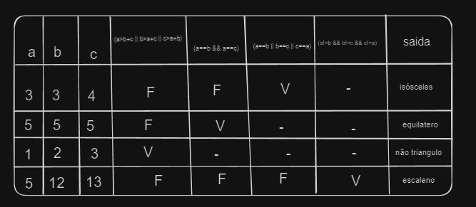

# Prova Ferrasa - 1

## Tópicos a serem abordados

- Estrutura de pseudo-código
- Variáveis
- Estrutura de decisão
- Estrutura de repetição
- Linguagem C

## Explicações

```
Algoritmo // Nome do algoritmo PARA
Inicio
 Var
  Literal: nome[20];
  Inteiro: idade, i;

 PARA i DE 1 ATÉ 10 FAÇA // for(i=0;i<10;i++)
  ESCREVA "Digite o seu nome: "; // printf("Digite seu nome: ");
  LEIA nome; // scanf("%s", nome);
  ESCREVA "Digite sua idade: "; // printf("Digite sua idade: ");
  LEIA idade; // scanf("%d", &idade);

  SE idade >= 18 // if(idade>=18)
   ENTÃO ESCREVA "Pode dirigir"; // printf("Pode dirigir");
   SE NÃO ESCREVE "Não pode dirigir"; // else printf("Não pode dirigir");
 FIM_PARA;
Fim.
```

```
Algoritmo // Nome do algoritmo FAÇA ENQUANTO
Inicio
 Var
  Literal: nome[20];
  Inteiro: idade, i;

 FAÇA // do
  ESCREVA "Digite o seu nome: "; // printf("Digite seu nome: ");
  LEIA nome; // scanf("%s", nome);
  ESCREVA "Digite sua idade: "; // printf("Digite sua idade: ");
  LEIA idade; // scanf("%d", &idade);

  SE idade >= 18 // if(idade>=18)
   ENTÃO ESCREVA "Pode dirigir"; // printf("Pode dirigir");
   SE NÃO ESCREVE "Não pode dirigir"; // else printf("Não pode dirigir");

  i = i + 1;
 ENQUANTO i<10; // while(i<10);
Fim.
```

```
Algoritmo // Nome do algoritmo ENQUANTO FAÇA
Inicio
 Var
  Literal: nome[20];
  Inteiro: idade, i;

 ENQUANTO i<10 FAÇA // while(i<10)
  ESCREVA "Digite o seu nome: "; // printf("Digite seu nome: ");
  LEIA nome; // scanf("%s", nome);
  ESCREVA "Digite sua idade: "; // printf("Digite sua idade: ");
  LEIA idade; // scanf("%d", &idade);

  SE idade >= 18 // if(idade>=18)
   ENTÃO ESCREVA "Pode dirigir"; // printf("Pode dirigir");
   SE NÃO ESCREVE "Não pode dirigir"; // else printf("Não pode dirigir");

  i = i + 1;
 FIM_ENQUANTO;
Fim.
```

```c
# include <stdio.h>
# include <locale.h>

main(){
setlocale(LC_ALL,"Portuguese");

float a,b,c;

printf("==============================================================\n");
printf("Informe os lados A, B e C do triângulo: \n");
scanf("%f %f %f", &a,&b,&c);

if (a<b+c && b<a+c && c<a+b){
    if (a==c && b == c){
        printf("Triângulo Equilátero.");
    }
    else if (a!=c && b!=a && b!=c){
        printf("Triângulo Escaleno.");
    }
    else {
        printf("Triângulo Isósceles.");
    }
}

else {
    printf("Não corresponde a um triângulo!");
}
printf("\n==============================================================");
}
```

```
Algoritmo Triangulos
 VAR
  INTEIRO: a,b,c;
 INCIO
  ESCREVE "DIGITE A: ";
  LEIA a;
  ESCREVE "DIGITE B: ";
  LEIA b;
  ESCREVE "DIGITE C: ";
  LEIA c;

  SE a<b+c .E. b<a+c .E. c<a+b
   ENTÂO SE a == c .E. b == c
    ENTÃO ESCREVA "Triângulo Equilátero.";
    SENÃO SE a <> c .E. b <> a .E. b <> c
     ENTÃO ESCREVA "Triângulo Escaleno.";
    SENÂO ESCREVE "Triângulo Isósceles.";
   SENÂO ESCREVE "Não corresponde a um triângulo!";
```

**Código SAMANTA do Triangulo:**

```c
#include <stdio.h> 
#include <locale.h> 

int main(){ 
 setlocale (LC_ALL, "portuguese"); 
 int a, b, c; 
 
 printf("informe um valor inteiro para o lado A de um triângulo:\n "); 
 scanf ("%d", &a); 
 
 printf("informe um valor inteiro para o lado B de um triângulo:\n "); 
 scanf ("%d", &b);
 
 printf("informe um valor inteiro para o lado C de um triângulo:\n "); 
 scanf ("%d", &c); 
 
 if (a>b+c || b>a+c || c>a+b) 
  printf ("não é um triângulo");
 else if (a==b && a==c) 
  printf ("é um triângulo equilatero"); 
 else if (a==b || b==c || c==a) 
  printf ("é um triângulo isósceles"); 
 else if (a!=b && b!=c && c!=a) 
  printf ("é um triângulo escaleno"); 
  
 return 0;
}
```

### Número primo

```
Algoritmo Primos
 VAR 
  INTEIRO: i, j, div, somaPrimo;
 INCIO
  somaPrimo = 0;
  PARA i DE 1 ATÉ 1000 FAÇA
   div = 0;
   PARA j de 2 ATÉ i FAÇA
    SE i % j == 0
     ENTÃO div = div + 1;
   FIM_PARA;
   
   SE div == 1
    ENTÃO somaPrimo = somaPrimo + i;
  FIM_PARA;
  ESCREVE "A soma de todos os número primos é: ", somaPrimo;
FIM.
```

#### Em Linguagem C

```c
#include <stdio.h>

int main() {
  int i, j, div, somaPrimo;
  somaPrimo = 0;

  for (i = 1; i <= 1000; i++) {
    div = 0;
    for (j = 2; j <= i; j++) {
      if (i % j == 0) {
        div++;
      }
    }
    if (div == 1) {
      somaPrimo += i;
    }
  }
  printf("A soma de todos os números primos é: %d\n", somaPrimo);
  
  return 0;
}
```

### Teste de mesa


