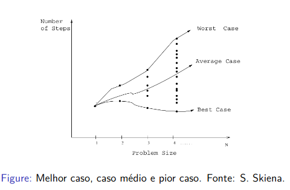
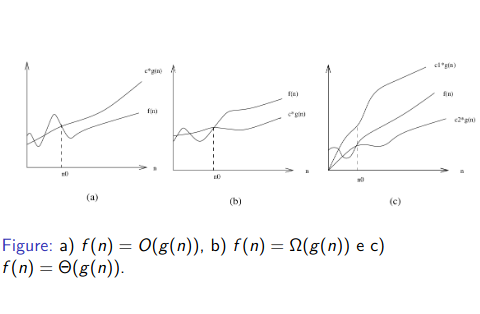

# Conceitos e Notação Assintótica

## Sumário

- Análise de Algoritmos
- Comportamento Assintótico de Funções

## Objetivo da Aula

- Entender os objetivos da análise de algoritmos
- Entender os tipos de análise de algoritmos
- Apresentar a notação assintótica

## Tipos de Análise

- Análise de um algoritmos em particular
- Análise de uma classe de algoritmos
- Cota inferior para o problema

> Quando um algoritmo tem complexidade de tempo igual a cota inferior para o problema, dizemos que o algoritmo é `ótimo`.

## Análise experimental: implementar e medir o tempo?

- O tempo real de execução depende:
  - da qualidade da implementação
  - da linguagem de programação
  - do compilador ou interpretador
  - do sistema operacional
  - paginação de memória
  - da carga do sistema
  - do hardware

## Medir ou não o tempo de execução?

- Implementar e avaliar os tempos de execução: quando...
  - vários algoritmos têm a mesma complexidade de tempo
  - a análise de pior caso não condiz com o comportamento dos algoritmos na prática
  - obter informações sobre o algoritmo que possam ser usadas para melhorá-lo

***

- Implementar e fazer experimentos (problemas de otimização combinatória)
  - medir a qualidade das soluções e o tempo de execução de heurísticas

***

- a análise da complexidade de tempo dos algoritmos é sempre importante
- experimentos podem ser úteis

## Análise Experimental de Algoritmos

- É difícil projetar experimentos
  - escolha das instâncias
  - escolha de parâmetros dos algoritmos
    - p. **exemplo**: estruturas de dados usadas
  - projeto dos experimentos
    - hipóteses a serem testadas
    - parâmetros a serem testadas
    - número de repetições e métodos estatísticos
    - forma de reportar os resultados

## Função de Complexidade

- Função de Complexidade de Pior Caso
  - A função de complexidade de tempo de pior caso de um algoritmo é a medida do tempo necessário para executar o algoritmo em qualquer instância de tamanho `n`.
  - Uma função de complexidade `f(n)` não representará o tempo real de execução, mas o número de vezes que operações computacionais são executadas.

### Exemplo: Encontrar o Máximo de um Vetor

- **Problema:** encontrar o maior elemento de um vetor

```python
def maior(A, n):
  max = A[0]
  for i in range(1, n):
    if A[i] > max:
      max = A[i]
  return max
```

***

- **Operação elementar:** comparação de elementos
- **Complexidade de tempo:** `f(n) = n-1`, para `n > 0`.
- `f(n)` é o número de comparações de elementos do vetor feitas pelo algoritmo

## Tipos de Análise

- Algoritmos para encontrar o máximo de um vetor tem o tempo uniforme, isto é, para toda entrada de tamanho `n`, o número de comparações é o mesmo.
- **Quando o tempo não é uniforme, temos 3 tipos de análises:**
  1. de melhor caso
  2. de caso médio
  3. de pior caso



### Exemplo: Busca Sequencial em Vetor

- Assuma que a busca sempre termina em sucesso.
  1. Melhor caso: `f(n) = 1`
  2. Pior caso: `f(n) = ??`
  3. Caso médio: `?`

### Análose de Caso Médio da Busca Sequencial

- `pi` = a probabilidade do elemento procurado estar na posição `i`.
- o elemento procurado está no vetor.
- `i` comparações para encontrar o i-ésimo elemento

***

- `f(n) = 1p1 + 2p2 + 3p3 + ... + npn`
- `pi` = a probabilidade do elemento procurado estar na posição `i`.

***

- distribuição das probabilidades `pi` ?
- distribuição uniforme
  - `pi = 1/n` para todo `i`

***

`f(n) = 1/n*(1 + 2 + 3 + ... + n) = 1/n*((n*(n+1))/2) = (n+1)/2`

***

- E se o elemento nem sempre estiver no vetor?

### Conclusão

- **Análise de médio** muitas vezes é difícil
- **Análise de melhor caso** pode ser muito otimista
- **Análise de pior caso** com frequência é útil, mas pode ser pessimista demais

***

- **se o pior caso é baixo** então o algoritmo é eficiente

#### Exemplos onde pior caso é pessimista demais

1. Algoritmo Quicksort

- pior caso `O(n²)`
- caso médio `O(n * log(n))`

2. Algoritmo Simplex para programação linear

- pior caso exponencial
- caso médio `O(n³)`

## Comportamento Assintótico de Funções

- É difícil deduzir a função exata para a complexidade:
  - valores muito diferente para diferentes tamanhos de entradas
  - dependência de muitos detalhes e de uma implementação específica.

***

- A análise assintótica leva em conta:
  - Entradas grandes
  - O crescimento da função de complexidade

## Ordem de Crescimento: O(.) ("Big Oh")

- Definimos `O(g(n))` como sendo o conjunto de todas as funções `f(n)` que satisfazem:
  - Existe um `c > 0`, Existe um `n0 > 0`
  - tais que
  - `0 <= f(n) <= c*g(n)`, Pra todo `n >= n0`

- Notação:
  1. `f(n)` pertence `O(g(n))` ou
  2. `f(n) = O(g(n))`
- e lê-se "`f` de `n` é o grande de `g` de `n`".

***

- Exemplo:
  1. Seja `f(n) = 2n² + 3n + 4` e `g(n) = n²`.
  - **Pergunta-se:** `f(n) = O(g(n))`?
  - Note que `2n² + 3n + 4 <= 2n² + 3n² + 4n² = 9n²`, para todo `n >= 1`.
  - Logo, `f(n) <= 9*g(n)` para todo `n >= 1`.
  - Portanto, `f(n) = O(g(n))`.

## Ordem de Crescimento: M(.) ("Ômega")

- `M(g(n))` é o conjunto de todas as funções `f(n)` tais que:
  - Existe um `c > 0`, Existe um `n0 > 0`
  - tais que
  - `0 <= c*g(n) <= f(n)`, Pra todo `n >= n0`

## Ordem T(.) ("Theta")

- Definimos `T(g(n))` assim:
- `T(g(n)) = {f(n) :` Exite um `c1 > 0`, Existe um `c2 > 0`Existe um `n0 > 0`
- tais que
- `0 <= c1*g(n) <= f(n) <= c2*g(n)`, Para todo `n > n0}`

## Ilustração de Crescimento Assintótico



## Ordem o() e w()

- Informalmente, as notação `f(n) = o(g(n))` e `f(n) = w(g(n))` estabelecem relações de crescimento estritamente menor e estritamente maior, respectivamente.
  - `o(g(n)) = {f(n) :`Para todo `c > 0`, Existe um `n0`
  - tal que
  - `0 <= f(n) < c*g(n)` Para todo `n >= n0}`

***

- `w(g(n) = {f(n) : )` Para todo `c > 0`, Existe um `n0`
- tal que
- `0 <= c*g(n) < f(n)` Para todo `n > n0}`

***

- `f(n) = o(g(n))` implica que

```math
lim   f(n) / g(n) = 0
n->infinito
```

- `f(n) = w(g(n))` implica que

```math
lim   f(n) / g(n) = infinito
n->infinito
```

- Quando os limites acima existem, as recíprocas também são válidas.
- Assim, pode-se usar esses limites para mostrar as relações de `o(.)` e `w(.)`.

## Exemplos de Algoritmos e Ordens de Crescimento

- constante: `a = b + c` (uma expressão aritmética sem chamadas de funções)
- logarítmico: busca binária
- linear: encontrar o máximo de elementos em um vetor
- "linerítmico" `O(n * log(n))`: merge sort
- quadrático: verificar todos os pares de elementos
- cúbico: verficar todas as triplas de elementos
- exponencial: verificar todos os subconjuntos de um conjunto
- fatorial: verficar todas as permutações de uma sequência

## Exercício

f(n) | g(n) | O() | M() | T() | o() | w()
:-- | :-: | :-: | :-: | :-: | :-: | :--
2n³-10n² | 25n²+37n | F | V | F | F | V
56 | log(30) | V | V | V | F | F
log3(n) | log2(n) | V | V | V | F | F
n³ | 3^n | F | F | F | V | F
n! | 2^n | F | F | F | F | V(?)
n*log(n+n²) | n² | V | V | V | F | F
sqrt(n) | log(n) | F | F | F | F | V(?)
log(n) | log(n²) | V | V | V | F | F
