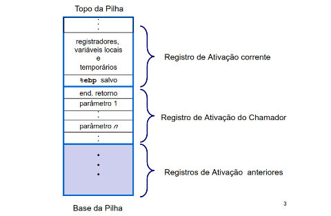
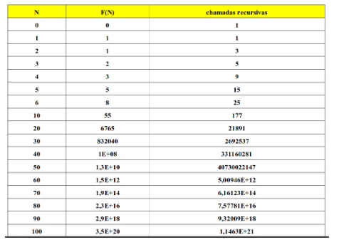
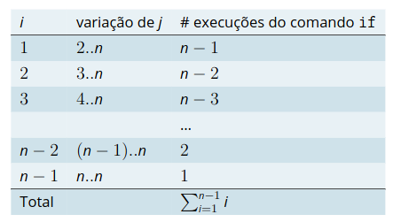
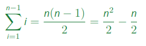
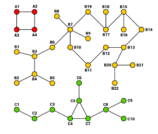
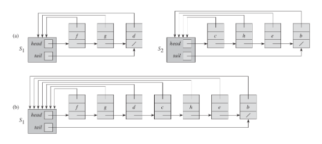

# Princípios de Análise de Algoritmos II

- Sumário
  - Objetivos da Aula
  - Algoritmos Recursivos
  - Análise de Algoritmos Iterativos e Recursivos Simples
  - Exemplo de Análise de Algoritmo
  - Um exemplo de Problema Computacional e de sua Análise

## Objetivos da Aula

- Algoritmos Iterativos X Recursivos
- Análise de Algoritmos Iterativos com Exemplos

## Algoritmos Recursivos

- **Algoritmo Recursivo:** é um procedimento que chama a si mesmo para resolver um problema, reduzindo-o a um ou mais subproblemas menores até atingir um caso base que é resolvido sem recursão.
- **Algoritmo Iterativo:** é um procedimento que utiliza repetições para executar uma série de instruções de forma repetida até que uma condição de parada seja alcançada, resolvendo o problema passo a passo de maneira sequencial.

### Recursão - Exemplo

- Soma dos `n` primeiros números naturais

```python
def soma_rec(n:int) -> int:
  if n == 0:
    return n
  return n + soma_rec(n-1)
```

> soma_rec(4) = 4 + soma_rec(3) = 4 + 3 + soma_rec(2) = 4 + 3 + 2 + soma_rec(1) = 4 + 3 + 2 + 1 + soma_rec(0) = 4 + 3 + 2 + 1

### Execução da Recursão

- Cada chamada de procedimento, recursivo ou não, `empilha` na pilha do ambiente de execução um `registro de ativação` contendo:
  - Endereço de retorno
  - Argumentos
  - Variáveis locais
  - outras informações
- Ao término da execução, o registro de ativação é desempilhado e o valor devolvido pelo procedimento, quando houver, é gravado no topo da pilha para ser utilizado pelo procedimento chamador.



### Recursão e Iteração

- Todo algoritmo recursivo pode ser transformado em um algoritmo iterativo com a mesma complexidade de tempo.
- Em alguns casos, a versão iterativa necessita implementar explicitamente uma pilha.

## Análise de Algoritmos Iterativos e Recursivos Simples

### Recursão e Iteração - Soma dos `n` primeiros números naturais

- Iteração:

```python
def soma_it(n: int) -> int:
  soma = 0
  for i in range(n+1):
    soma += i
  return soma
```

- Recursão:
```python
def soma_rec(n: int) -> int:
  if n <= 0:
    return n
  return n + soma_rec(n-1)
```

```python
def soma_formula(n: int) -> int:
  return n * (n+1) / 2
```

#### Análise da complexidade de Tempo e de Espaço dos Algoritmos

Algoritmo | Complexidade de Tempo | Complexidade de Espaço
:-- | :-: | --:
soma_it | O(n) | O(1)
soma_rec | O(n) | O(n)
soma_formula | O(1) | O(1)

### Algoritmos Iterativos e Recursivos

```python
def fatorial_iterativo(n: int) -> int:
  fatorial = 1
  for i in range(1, n+1):
    fatorial *= i
  return fatorial

def fatorial_recursivo(n: int) -> int:
  if n == 0:
    return 1
  else:
    return n * fatorial_recursivo(n-1)
```

- Qual é a complexidade de tempo desse algoritmos?
- Qual é a complexidade de espaço desses algoritmos?

#### Análise da Complexidade de Tempo e de Espaço dos Algoritmos

Algoritmo | Complexidade de Tempo | Complexidade de Espaço
:-- | :-: | --:
fatorial_iterativo | O(n) | O(1)
fatorial_recursivo | O(n) | O(n)

- `Recursão` é uma ferramenta muito poderosa para projetar algoritmos: aguardem as próximas aula
- A profundidade da recursão muitas vezes é sublinear

- Porém, `atenção`...

- Às vezes, as complexidades de tempo das versões recursivas e iterativas são muito `diferentes`... como no exemplo a seguir

### Fibonacci Recursiva

- A função abaixo calcula o n-ésimo termo da sequência de Fibonacci:

```python
def fib(n: int) -> int:
  if n <= 1:
    return n
  return fib(n-1) + fib(n-2)
```

- Qual é a complexidade de tempo desse algoritmo?
  - Difícil, estudaremos adiante, mas...

- Número de Chamadas Recursivas:



### Fibonacci Iterativa

- A função abaixo calcula o n-ésimo termo da sequência de Fibonacci:
```python
def fib(n: int) -> int:
  if n <= 1:
    return n
  fib_n_menos_2 = 0
  fib_n_meno_1 = 1
  for i in range(2,n):
    fib_n = fib_n_meno_1 + fib_n_menos_2
    fib_n_menos_2 = fib_n_meno_1
    fib_n_meno_1 = fib_n
  return fib_n_meno_1 + fib_n_menos_2
```

- Qual é a complexidade de tempo desse algoritmo?
- Qual é a complexidade de espaço desse algoritmo?

### Desafio dos conjuntos

- Enumere todos os subconjuntos {1, 2, 3}
  - [Resolução em python](./enumera.py)

- Enumere todos os subconjutos com permutação
  - [Resolução em pyhton](./enumeraP.py)

### Análise de Algoritmos Iterativos

- Comandos básicos de tempo constante
  - Atribuições, operações lógicas e aritméticas simples, etc.
  - A chamada de procedimento/função (não a sua execução)

- Laços / Iterações
  - Multiplica a complexidade de tempo do bloco pelo número de vezes que o laço é executado
- Laços Justapostos
  - Soma-se a complexidade dos laços
  - Veremos que `f(n) + f(n) = O(f(n))`
- Laços Aninhados (com índices fixos)
  - Princípio da multiplicação
- Chamadas de procedimentos/funções

### Análise de Algoritmos Recursivos

- Via equações de Recorrência - estudaremos adiante

## Exemplo de Análise de Algoritmo

### Problema da Ordenação

- **Problema:** Ordenar um vetor de `n` inteiros
- **Entrada:** vetor `A[1..n]` contendo `n` inteiros
- **Saída:** vetor `A[]` tal que `A[i] <= A[i+1]` para `1 <= i <= n - 1`.

### Instância e Tamanho da Instância

- Um vetor com `n` inteiros é uma `instância`
- O tamanho da instância é `n`

### Ordenação por Seleção

```c
void selectionSort(int V[], int n){
  int i, j, min_index;

  // i marca o início do subvetor ainda não ordenando
  for(i = 0; i < n - 1; i++){
    // encontra  o índice do mínimo entre i e n-1
    min_index = i;
    for(j = i + 1; j < n; j++){
      if(V[j] < V[min_index])
        min_index = j;
    }
    // troca o mínimo com o primeiro item
    swap(V[min_index], V[i]);
  }
}
```

### Análise

- Podemos calcular o número total de operações que o algoritmo executa
- Para a análise assintótica, podemos escolhemos a operação que é executada o maior número de vezes (por quê?)
- O `if` no laço mais interno compara elementos do vetor e é a operação executada mais vezes





- **Conclusão 1:** O algoritmo de ordenação por seleção faz `n²/2 - n/2` comparações entre chaves em um vetor com `n` elementos
- **Conclusão 2:** O tempo de execução do algoritmo de ordenação por seleção é `O(n²)`.

- Análise
  - Pior caso => `O(n²)`
  - Melhor caso => `O(n²)`
  - Ordenação por seleção não é sensível à entrada
  - Em qualquer caso, o tempo de execução é quadrático
  - Complexidade de Espaço => `O(1)`

## Um exemplo de Problema Computacional e de sua Análise

### Exemplo: Estrutura para União de Conjuntos Disjuntos

- Operações:
  - Make-Set(x)
  - Union(x, y)
  - Find-Set(x)

- Aplicação: Componentes Conexos de um Grafo



```
Componentes(G)
  para cada vértice v de V(G) faça
    Make-Set(v)
  para cada aresta (u, v) de E(G) faça
    se Find-Set(u) <> Find-Set(v) então
      Union(u, v)

Mesmo-Componente(u, v)
  devolve Find-Set(u) == Find-Set(v)
```

### Implementação com Listas Ligadas

- O primeiro elemento da lista identifica o conjunto
- Cada conjunto é uma lista ligada
- Há ponteiros para o iníncio e para o fim de cada lista
- Cada nodo possui um ponteiro para o início da lista

### Exemplo



1. **Conjuntos:** {f,g,d} e {c,h,e,b}
2. Feita a união dos dois conjuntos.

> Fonte: Cormen, T. H. et al..

### Implementação para a operação Union(x, y)

- Union(x,y)
  - Concatena a lista `y` no final da lista `x`
  - Atualiza os ponteiros

### Exemplo de Execução

- `n` operações que requerem tem `O(n²)`
  - Union(x2, x1)
  - Union(x3, x2)
  - Union(x4, x3)
  - ...
  - Union(xN, xN-1)

### Melhoria

- Armazena o tamanho de cada lista
- Concatena sempre a menor lista no final da maior
- Resolve empates de forma arbitrária

### Análise

- `m` operações (Make-Set/Find/Union) sobre `n` elementos
- Tempo total:
  - `O(m + n*log(n))`

1. Número máximo de uniões: n-1
2. Considere um elemento `x`
  - A cada atualização do ponteiro de `x`, conjunto resultante no mínimo dobra de tamanho
  - Depois de `k` atualizações, o conjunto de `x` terá no mínimo `2^k` elementos.
  - Como o máximo de elementos é `n`, então `2^k <= n` e, portanto, `k <= log(n)`
  - Atualizar o tamanho da lista e o ponteiro para o final da lista leva tempo `O(1)`

1. Portanto, o tempo total das operações de união é `O(n*log(n))`
2. Operações de `Find(x)` e `Make-Set(x)` possuem tempo `O(1)`.
3. Portanto o tempo total das `m` operações é `O(m + n*log(n))`

### Custo Amortizado

- Note que concluímos que o tempo total das operações de uniã é `O(n * log(n))`. Porém, uma dado operação de união pode levar mais tempo do que `O(log(n))` (quanto mais? e por quê?). Ainda assim, podemos dizer que o `custo amortizado` de cada operação de união é `O(log(n))`.
- Para saber mais sobre tempo amortizado, leia [aqui](http://www.ime.usp.br/~pf/analise_de_algoritmos/aulas/amortized.html). Para saber mais sobre este tipo abstrato de dados para união de conjuntos disjuntos (*union-find*), consulte¹.

> ¹T.H. Cormen et al.., Introduction to Algorithms (ou a sua tradução).
