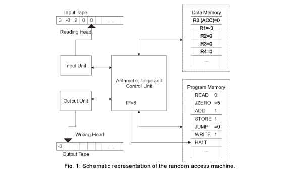

# Princípios de Análise de Algoritmos

## Sumário

- Problema Computacional e Algoritmos
- Modelo RAM (Random Access Machine)
- Computabilidade
- Tese de Church-Turing
- Projeto e Análise de Algoritmos
- Projeto de Algoritmos Eficientes
- Um Exemplo de Problema Computacional e de sua Análise

## Problema Computacional e Algoritmo

- Um problema computacional especifica a relação entre *entradas* possíveis e *saídas* esperadas.

### Algoritmo
  
  - Um *algoritmo* é um procedimento computacional que transforma uma *entrada* de um problema computacional em uma *saída* esperada.

### Procedimento Computacional

- Por *procedimento computacional* entendemos um conjunto finito de instruções simples e precisas que quando executado produz o resultado em um número finito de passos.

- Definição formal versus informal
  - Português
  - Pseudocódigo
  - Linguagem de Programação
  - Máquina de Turing
  - Máquina de Acesso Aleatório (RAM)

### Máquina de Turing

- 
- 

## Modelo: RAM (Random Access Machine)

- Intruções lógicas, aritméticas, controle de fluxo
- Memória infinita de acesso aleatório
- Cada posição da memória pode armazenar um número inteiro qualquer
- Operações feitas com 1 instrução(*"tempo constante"*)

- 

## Computabilidade e o Problema da Parada

- Nem toda função matemática é computável
  - Argumento de Contagem
  - Problema específicos: Problema da Parada

## Tese de Church-Turing

### Equivalência de Modelos Computacionais

- Máquina de Turing
- Modelo RAM
- Cálculo Lambda

### Tese de Church-Turing

- Uma função é computável se, e somente se ela pode ser computada por uma máquina de Turing.

## Projeto e Análise de Algoritmos

- Projetar algoritmos
- Medir a eficiência de algoritmos
- Comparar a eficiência de algoritmos
- Classificar problemas computacionais

### Instância de Problema Computacional

- **Instância:** Uma instância de um problema computacional é uma entrada especifica para o problema.
- **Tamanho da Instância:** comprimento da instância *(número de número, número de dígitos ou símbolos)*

### Tamanho da Instância versus Tempo de execução

- 

### Eficiência

- A eficiência de um algoritmo sequencial é medida pela avalição 
  - do tempo de execução
  - da memória utilizada

- Empregamos as expressões *complexidade de tempo* e *complexidade de espaço* para se referir à análise do tempo de execução e da memória utilizada pelo algoritmo, respectivamente.

### Eficiência de Algoritmos no Modelo RAM (Random Access Machine)

- Complexidade de tempo
  - Número de instruções executadads
- Complexidade de espaço
  - Número de células de memória necessárias para terminar a execução do programa *(sem contar o armazenamento da entrada do programa)*

## Projeto de Algoritmos Eficientes

### Precisamos de Algoritmos mais Rápidos?

- **Perguta:** Precisamos de algoritmos mais rápidos ou podemos esperar os computadores ficarem mais rápidos?

- Considere os seguintes dois algoritmos
1. Ordenação por Inserção: c1n² operações
2. Ordenação por Combinação (Merge): c2n*log*n operações

### Estimaremos os tempos de execução

- *Algoritmos mais lento* em um *computador muito rápido*
- *Algoritmos mais rápidos* em um *computador muito mais lento*

- Computador A será 1000 vezes mais rápido do que o Computador B

- **Computador A (rápido):** Ordenação por Inserção - `O(n²)`
  - Velocidade de processamento: `10¹⁰` instruções por segundo (1000 vezes mais rápido do que B)
  - Número de Instruções para resolver o problema: `2*n²` instruções
    - Implementação boa
    - Compilador otimizado

```
2(10⁷)² instruções
--------                    = 20000 segundos ou 5.5 horas
10¹⁰ instruções por segundo
```


- **Computador B (lento):** Merge Sort - `O(n*log(n))`  
  - Velocidade de processamento: 10⁷ instruções por segundo
  - Número de Instruções para resolver o problema: `50*n*log(n)`
    - Algoritmo mais complexo
    - Código não otimizado

```
50*10⁷log(10⁷) instruções
--------------              = 1163 segundos < 20 minutos
10⁷ instruções por segundo
```

- O melhor algoritmo foi muito mais rápido. E se fosse para ordenar 10⁸ números, a diferença seria muito maior.

- **Conclusão:** um computador mais rápido pode não ser suficientemente rápido para fazer a execução de um algoritmo ruim, terminar suficientemente rápido

- Ter um melhor algoritmo em mãos é melhor do que esperar os computadores ficarem mais rápidos.

## Um Exemplo de Problema Computacional e de sua Análise

### Exemplo: Estrutura para União de Conjuntos Disjuntos

- Operações:
  - Make-Set(x)
  - Union(x, y)
  - Find-Set(x)

#### Aplicação: Componentes Conexos de um Grafo

- 

```Pseudocodigo
Componentes(G)
  para cada vértice v de V(G) faça
    Make-Set(v)
  para cada aresta (u, v) de E(G) faça
    se Find-Set(u) <> Find-Set(v) então
      Union(u, v)

Mesmo-Componente(u, v)
  devolve Find-Set(u) == Find-Set(v)
```

### Implementação com Listas Ligadas

- O primeiro elemento da lista identifica o conjunto
- Cada conjunto é uma lista ligada
- Há ponteiros para o ínicio e para fim de cada lista
- Cada nodo possui um ponteiro para o início da lista

### Exemplo 

- 

1. Conjuntos: {f, g, d} e {c, h, e, b}
2. Feita a união dos dois conjuntos.

> Fonte: Cormen, T. H. et al..

### Implementação para operação Union(x, y)

- Union(x, y)
  - Concatena a lista `y` no final da lista `x`
  - Atualiza os ponteiros

### Exemplo de Execução

- `n` operações que requerem tempo `O(n²)`
  - Union(x2, x1)
  - Union(x3, x2)
  - Union(x4, x3)
  - ...
  - Union(xn, xn-1)

- Portanto a complexidade de tempo de *pior caso* do algoritmo é `O(n²)`. É possível melhorar?

### Melhoria

- Armazena o tamanho de cada lista
- Concatena sempre a menor lista no final da maior
- Resolve empates forma arbitrária

### Análise

- `m` operações *(Make-Set/Find-Set/Union)* sobre `n` elementos
- Tempo total:
  - Vamos mostrar que o tempo de pior caso é `O(m + n * log(n))`

1. O número máximo de uniões é n-1, depois disso só haverá 1 conjunto
2. Atualizar o tamanho da lista e o ponteiro para o início e para o final da lista leva tempo `O(1)`. A operação mais custosa do algoritmo é atualizar os ponteiros para o início da lista.
3. Considere um elemento `x`
  - A cada atualização do ponteiro de `x`, o conjunto resultante no mínimo dobra de tamanho
  - Depois de `k` atualizaçẽs, o conjunto de `x` terá no mínimo `2^k` elementos.
  - Como o número de elementos é `n`, então `2^k` <= `n` e, portanto, `k` <= *log*(`n`)
  - Logo, cada ponteiro é atualizado no máximo *log*(`n`).
  - O número de atualizações dos `n` ponteiros é no máximo `n * log(n)`.
4. Portanto, o tempo total das operações de união é `O(n * log(n))`
5. Operações de Find-Set(x) e Make-Set(x) possuem tempo `O(1)`
6. Logo o tempo total das `m` operações é `O(m + n * log(n))`

### Custo Amortizado

- Note que concluímos que o tempo total das operações de união é `O(n * log(n))`. Porém, uma dada operação de união pode levar mais tempo do que `O(log(n))` *(quanto mais? e por quê?)*. Ainda assim, podemos dizer que o *custo amortizado* de cada operação de união é `O(log(n))`.

> Para saber mais sobre tempo amortizado, leia [aqui](www.ime.usp.br/~pf/analise_de_algoritmos/aulas/amortized.html).

> Para saber mais sobre este tipo abstrato de dados para união de conjuntos disjuntos (union-find), consulte T. H. Cormen et al., Introduction to Algorithms (ou a sua tradução).
