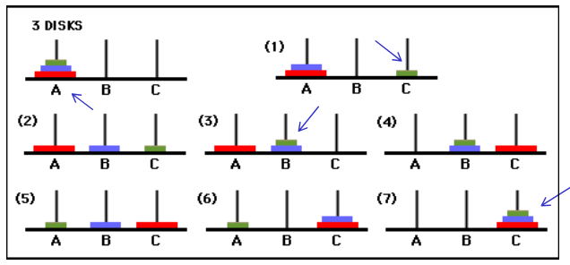

# Equações de Recorrência

Notação

- Função
    - `T(n) = T(n/2)+1`
- Sequência
    - `T0, T1, T3, ..., Tn`

```math
T(1) = 1
T(n) = 2 * T(n/2)+c*n
T(n) = 2 * T(n/2)+c*n = 2*(2*T(n/4)+c*n/2)+c*n = 
=> 2*(2*(2*T(n/8)+c*n/4)+c*n/2)+c*n =
    .
    .
    .
    k interações

T(n) = 2^k*T(n/2^k)+c*n*k

k=?     n/2^k = 1

k = log2(n)

        log2(n)
T(n) = 2*1+c*n*log2(n)
       n

T(n) = n¹+c*n*log(n)
T(n) = O(n*log(n))
```

```math
T(1) = 1
T(n) = 4*T(n/2)+c*n
T(n) = 4*(4*T(n/4)+c*n/2)+c*n
T(n) = 4*(4*(4*T(n/8)+c*n/4)+c*n/2)+c*n =
    .
    .
    .
    k interações
                        k-1                                     k-1
T(n) = 4^k*T(n/2^k)+Somatorio 4^i/2^i*c*n = 4^k*T(n/2^k)+c*n*Somatorio 2^i
                        i=0                                     i=0

k = log2(n)

Sn = a1(r^n - 1)/r - 1
Sn = 2^n - 1 / 2 - 1 = 2^n - 1

       log2(n)   log2(n-1)
T(n) = 4*1+c*n*Somatorio 2^i
                i=0

= n² + c*n*(n-1)
= n²+c*n² - c*n

O(n²)
```    

## Torre de Hanói

Projeto de algoritmo utilizando indução

Análise com relação de recorrência

Jogos e Computação:
    - Xadrez
    - Go

De Alan Turing (1950) ao AlphaZero (2017)



H(n) = `num`. mínimo de movimentos para resolver a torre com `n` discos.

1. Qual é o valor de `H(n)?`
2. Projete um algoritmo para resolver a torre de Hanói.

Vamos provar que sabemos resolver a torre de Hanói com números mínimo de movimentos?

**Induação Matemática sobre `n`, o número de discos**

**Base da Indução:** se há 1 disco `(n=1)` então mova ele da haste `A` para a haste `C` com 1 movimento. Temos que `H(1) = 1`

**Hipótese da Indução:** Sabemos resolver o problema com `n-1` discos com `H(n-1)` movimentos.

**Passo da Indução:** Mostrar que sabemos resolver o problema com `n` discos e o número mínimo `H(n)` movimentos.

1. Utilizando a hipótese da indução, mova os `n-1` discos de cima para a haste `B` usando `H(n-1)` movimentos.
2. Usando 1 movimento, mova o maior disco da haste `A` para a haste `C`.
3. Novamente use a hipótese da indução para mover os `n-1` discos da haste `B` para haste `C`.

> Falta argumentar que essa solução utiliza o menor `núm`. de movimentos.

Assim, mostramos que `H(n)` = `2*H(n-1)+1`

```python
def hanoi(n, origem, temp, destino):
    if n > 0:
        hanoi(n-1, origem, destino, temp) # RECURSÃO com n-1 discos
        if origem[0]:
            disk = origem[0].pop()
            print "moving " + str(disk) + " from " + origem[1] + \
                " to " + destino[1]
            destino[0].append(disk)
        hanoi(n-1, temp, origem, destino) # RECURSÃO com n-1 discos

origem = ([1,2,3,4], "origem")
destino = ([], "destino")
temp = ([], "temp")
print origem, temp, destino
hanoi(len(origem[0]), origem, temp, destino)
print origem, temp, destino
```
[Código de Hanoi em pyhton](./hanoi.py)

#### Prova por indução

Vamos mostrar que a recorrênci  ...tem solução `H(n) = 2^n - 1`

```math
H(1) = 1
H(n) = 2*H(n-1)+1, para n>1

H(n) = 2*H(n-1)+1 = 2*(2*H(n-2)+1)+1 =
=> 2*(2*(2*H(n-3)+1)+1)+1 = ... k interações

                                            k-1
depois de k interações: H(n) = 2^k*H(n-k)+Somatorio 2^i
                                            i=0

H(n-k) = H(1) quando k = n - 1

                                n-2
portanto, H(n) = 2^n-1 * 1 + Somatorio 2^i = 2^n-1 + 2^n-1 - 1 = 2^n - 1
                                i=0


H(1) = 1
H(n) = 2*H(n-1)+1
```
