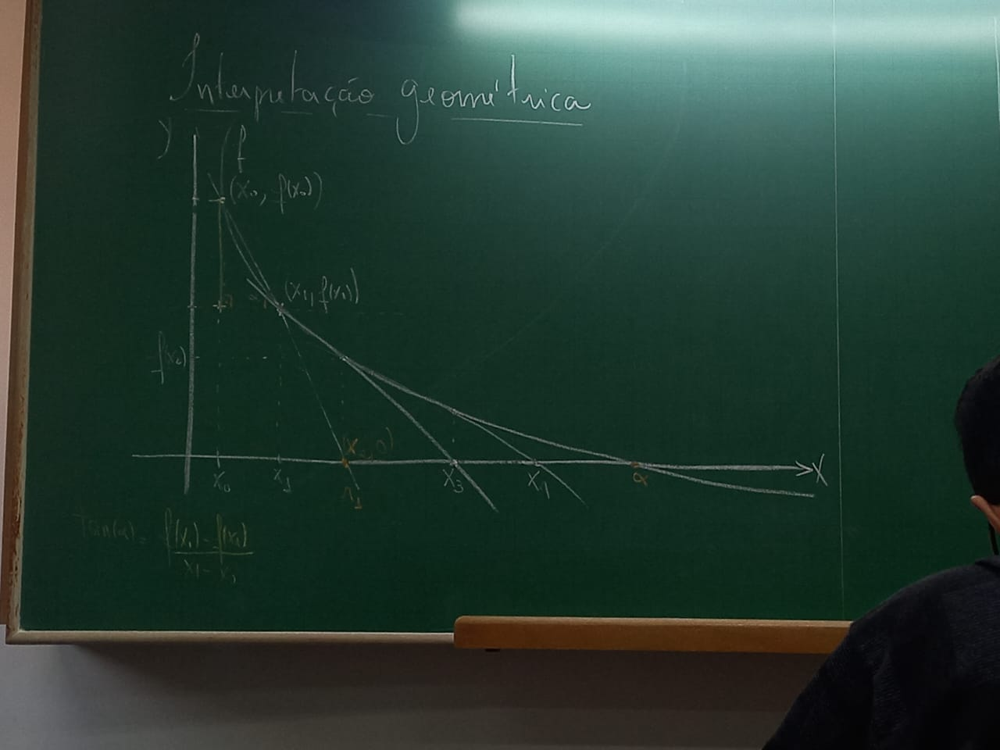

# O método da Secante

- O método de Newton-Raphson tem o incoveniente de necessitar da derivada da função
- O método da secante é obtido do método de Newton utilizando a seguinte aproximação para a derivada:
  - `f(xR) ≃ f(xR) - f(xR-1) / xR - xR-1`

```
No método de Newton 

xR+1 = (xR - f(xR)) / f'(xR)

xR+1 = (xR - f(xR)) / (f(xR) - f(xR-1) / xR - xR-1)

xR+1 = xR - f(xR) * (xR - xR-1) / (f(xR) - f(xR-1))

xR+1 = (xR(f(xR) - f(xR-1)) - f(xR)(xR - xR-1)) / (f(xR) - f(xR-1))

xR+1 = (xRf(xR) - xRf(xR-1) - xRf(xR) + xR-1f(xR)) / (f(xR) - f(xR-1))

xR+1 = (xR-1f(xR) - xRf(xR-1)) / (f(xR) - f(xR-1))

Resulta que

Xn+1 = (Xn-1f(Xn) - Xnf(Xn-1)) / (f(Xn) - f(Xn-1)), 

n >= 1 este é o método da secante
```



```
A inclinação da reta é f(x1)-f(x0) / x1 - x0

e sua equação é 
  y - f(x0) = ((f(x1)-f(x0)) / x1 - x0) * (x2-x0)

  x2 = (x0f(x1) - x1f(x0)) / (f(x1) - f(x0))
```

- A intepretação geométrica é que a reta secante ao gráfico de `f` que passa pelos pontos (Xn-1,f(Xn-1)) e (Xn, f(Xn)) cruza o eixo Ox exatamente no ponto Xn+1 dado por `Xn+1 = (Xn-1f(Xn) - Xnf(Xn-1)) / (f(Xn) - f(Xn-1))`
- **Exemplo:** Considerando a equação x*tan(x) - 1 = 0 utilizando o método da secante para obter uma aproximação de solução positiva.

> Chame `f(x) = x*tan(x)-1` e tome x0 = 0.75 e x1 = 1

K | Xk-1 | Xk | f(Xk-1) | f(Xk)
:-- | :-: | :-: | :-: | --:
1 | 0.75 | 1 | -0.301303 | 0.557408
2 | 1 | 0.837719 | 0.557408 | -0.069692
3 | 0.837719 | | -0.069692 | 
