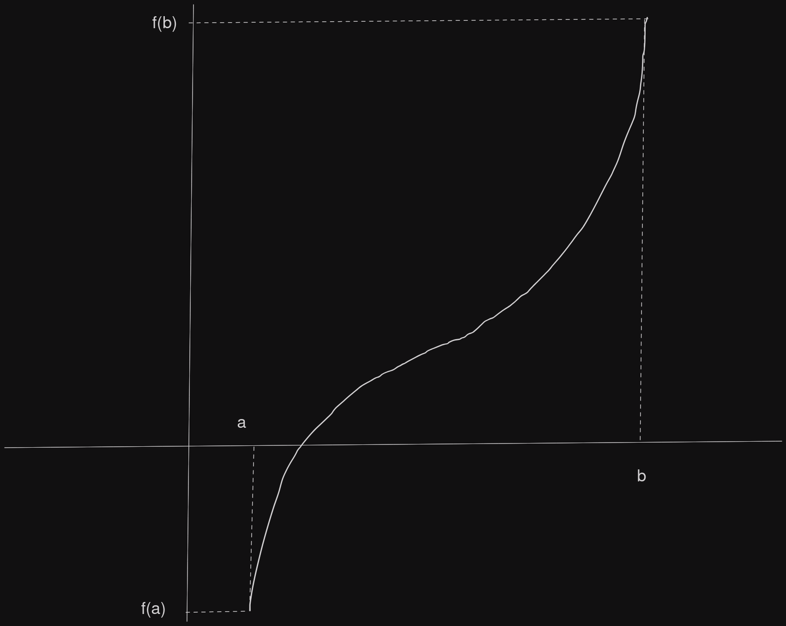
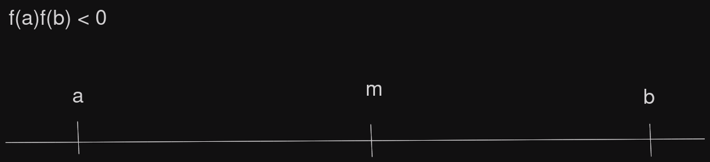
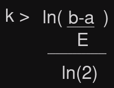
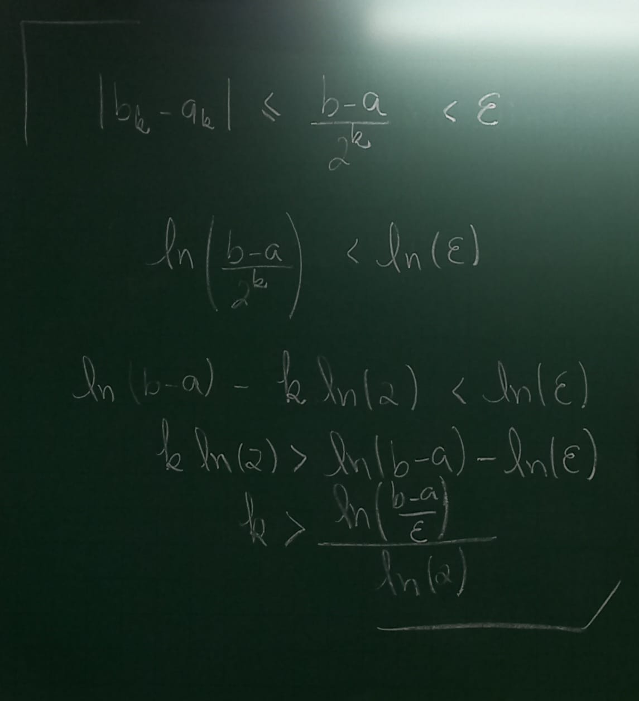

# Ementa

- Métodos Númericos na resolução de equações transcendentes:
  - Bisseção
  - Newton (Tangente)
  - Secante

- Métodos númericos na resolução de sistemas lineares:
  - Métodos diretos: eliminação de Gauss e decomposição L.U
  - Métodos iterativos: Gauss-Jacobi e Gauss-Seidel

#### P1: 09/09/24

- Interpretação polinomial:
  - Lagrange
  - Newton

- Integração Numérica:
  - Trapézio
  - Simpson

- Ajustes de Curvas:
  - Método dos mínimos quadradis caso discreto

#### P2: 18/11/24

# Zeros de funções transcendentes

- Estamos interessados em resolver numericamente a equação `f(x) = 0` onde `f` é uma função arbitrária. Por "resolver numéricamente" entendemos determinar uma aproximação para solução (exata) de `f(x) = 0`

## O método da Bisseção

- O Teorema do valor intermediário garante a existência de uma solução para `f(x) = 0` no intervalo *(a,b)* desde que: `f:[a,b] -> R` seja contínua e satisfazendo `f(a)f(b) < 0`
  - 
- Nestas condições, o método da Bisseção consiste em dividir o intervalo `[a,b]` ao meio obtendo `[a,m]` e `[m,b]`.
 - 

- Se `f(a)f(m) > 0` então `f(m)f(b) > 0`, pois `f(a)f(m)f(a)f(b) < 0`, ou seja, `[f(a)]²f(m)f(b) < 0` => `f(m)f(b) < 0`. 
- Assim a raiz estará no intervalo `[m,b]`.

- Repetimos o processo um número finito de vezes até encontrarmos a raíz (aproximada) desejada ou o intervalo que a contém.

> Considere `f:[a,b] -> R` contínua com `f(a)f(b) < 0`.

1. Obtenha o ponto médio do intervalo `[a,b]` isto é, `m = b+a/2`
2. Chame `a = a0`, `b = b0` e `m = m0`
3. Se `f(a)f(m) < 0`, então chame `a0 = a1` e `m0 = b1`
  - Se `f(b)f(m) < 0`, então chame `m0 = a1` e `b0 = b1`
4. Obtenha o ponto médio do intervalo `[a1,b1]`, `m1 = b1+a1/2`
5. Se `f(a1)f(m1) < 0`, então chame `a1 = a2` e `m1 = b2`
  - Se `f(b1)f(m1) < 0`, então chame `m1 = a2` e `b1 = b2`
6. Repita o processo `k` vezes, até obter a precisão `E` desejada, onde
  - 
  - 

### Exemplo
- Vamos determinar uma aproximação para uma raíz positiva da função `f(x) = (x/2)² - sen(x)` no intervalo `[1.5,2]`, x em radianos

K | ak | mk | bk | f(ak)f(mk)
:-- | :-: | :-: | :-: | --:
0 | 1.5 | 1.75 | 2 | > 0
1 | 1.75 | 1.875 | 2 | > 0
2 | 1.875 | 1.9375 | 2 | < 0
3 | 1.875 | 1.90625 | 1.9375 | > 0
4 | 1.90625 | 1.921875 | 1.9375 | 

- Para `k = 4` temos `m4 = 1.921875` como aproximação da raíz.

- Veja que `f(1.921875) = -0.015601`
- Para uma aproximação com precisão E = 10⁻⁴ devemos ter
  - `k > ln(b-a)/E / ln(2)` = `ln(0.5/10⁻⁴) / ln(2)`
  - `k > ln(5000)/ln(2)` ≃ `12.28771`
  - => `k = 13`

## Exercício:
- Considere `f(x) = (x²+1)sen(x)`. Quantas iterações (`k`) são necessárias para determinar uma solução aproximada de `f(x) = 0` no intervalo `[2,4]` com precisão de `E = 10⁻²`. Encontre tal solução.
  - `k > ln(4-2/10⁻²) / ln(2)` = `ln(200) / ln(2)`
  - ≃ `7.644`
  - => `k = 8`

K | ak | mk | bk | f(ak)f(mk) | f(2) > 0
:-- | :-: | :-: | :-: | :-: | --:
0 | 2 | 3 | 4 | > 0 | f(4) < 0 
1 | 3 | 3.5 | 4 | < 0 | f(3) > 0
2 | 3 | 3.25 | 3.5 | < 0 | f(3.5) < 0
3 | 3 | 3.125 | 3.25 | > 0 | f(3.25) < 0
4 | 3.125 | 3.1875 | 3.25 |  < 0 | f(3.125) > 0
5 | 3.125 | 3.15625 | 3.1875 | < 0 | f(3.1875) < 0
6 | 3.125 | 3.140625 | 3.15625 | > 0 | f(3.15625) < 0
7 | 3.140625 | 3.1484375 | 3.15625 | < 0 | f(3.140625) > 0
8 | 3.140625 | 3.14453125 | 3.1484375 | < 0 | f(3.1484375) < 0
  |  |  |  |  | f(3.14453125) < 0
