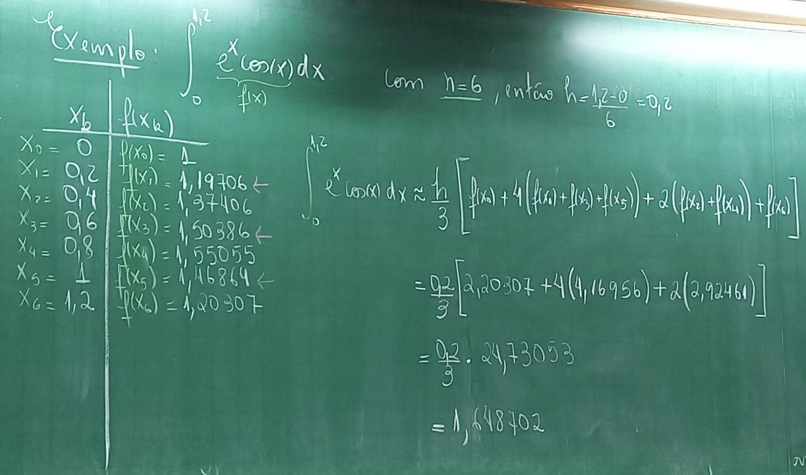
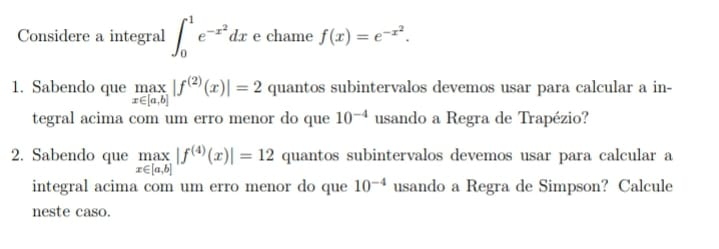

# Regra de Simpson

Neste caso vamos interpolar `f(x)` usando um polinômio de grau 2 e assim precisamos de 3 pontos:

`x0 = a`, `x1 = b+a/2` e `x2 = b`.

Pela forma de Lagrange o polinômio fica.

```

p2(x) = f(x0)*(x-x1)(x1-x2) + f(x1)*(x-x0)(x-x2) + f(x2)*(x-x0)(x-x1)
        -------------------   ------------------   ------------------
          (x0-x1)(x0-x2)        (x1-x0)(x1-x2)        (x2-x0)(x2-x1)
```

Assim,

```
  b          b
 I f(x)dx ≃ I p2(x)dx = f(x0)*w0 + f(x1)*w1 + f(x2)*w2
a          a
```

Onde

- `w0 = h/3`
- `w1 = 4h/3`
- `w2 = h/3`

Segue que

```
   x2
  I f(x)dx = f(x0)*h/3 + f(x1)*4h/3 + f(x2)*h/3 + Eno
x0


h/3 [f(x0) + 4f(x1) + f(x2)] + Eno
```

A menos de um eno `INTEGRAL f(x)` está próxima de `INTEGRAL p2(x)`.

A expressão

```
   x2
  I f(x)dx ≃ h/3[f(x0) + 4f(x1) + f(x2)]
x0
```

é fórmula de Simpson

O erro cometido é dado por

`Esimp = -h^5/90 * f^(4)(B) onde B pertence (a,b)`

## Regra de Simpson composta

Dado o intervalo [a,b] vamos dividi-lo em `n` subintervalos de mesma tamanho, como `n` par, onde `h=b-a/n` (comprimento de cada subintervalo) e assim

`a = x0 < x1 < x2... < xn=b`; `xj = x0 + hj, j=1,...,n`

Temos:

```
   Xn         x2         x4               xn
  I f(x)dx = I f(x)dx + I f(x)dx + ... + I f(x)dx
x0          x0        x2             xn-1
```

O erro comentido na fórmula composta é dado pela soma dos erros parciais. Aqui usamos `n/2` parábolas e portanto `n/2` parcelas de erro.

Uma estimativa para o erro neste caso fica a seguinte 

```
|Esimp| <= (b-a)h^4 * M
               ----
                180

onde M = máx|f^(4)m|
        x pertence [a,b]
```



## Exercício



```
  1
 I e^-x^2 dx ; h = b-a/n
0

1) |Etrap| <= (b-a)/12 * h^2 * max|f^(2)(x)|
                          x pertence [a,b]


|Etrap| < 10^-4 <=> 1-0/12(1/n)^2 * 2 < 10^-4

1/6 * 1/n^2 < 10^-4

6n^2 > 1/10^-4


2) |Esimp| <= (b-a)h^3/180 * max|f^(4)(x)|
                x pertence [a,b]
```
