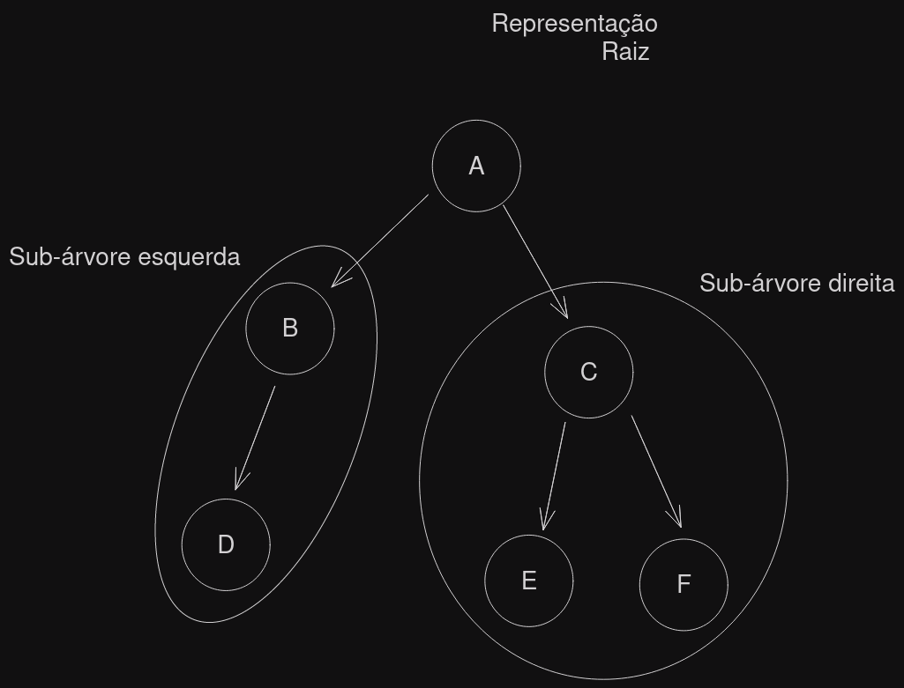
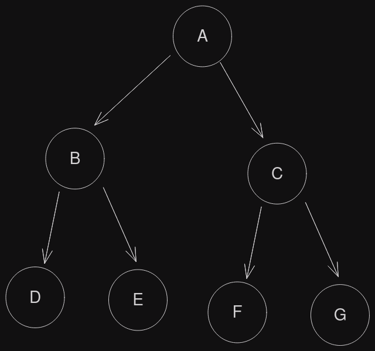
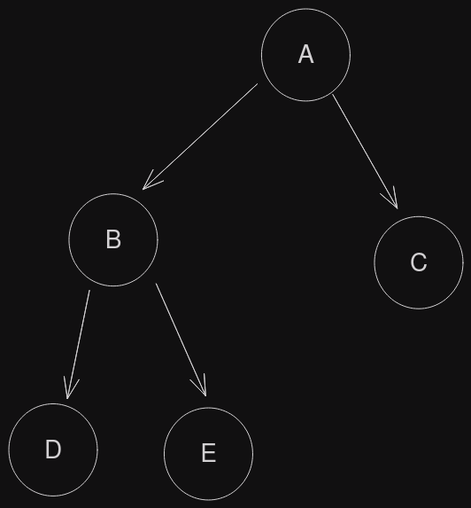

# Árvores

## Árvore não binária

- Estruturas não lineares
- Existem inumeros tipos de árvores

> Uma árvore é uma estrutura que possui uma hierarquia entre os dados.

## Árvore binárias

- Um tipo de árvore mais comum
- Propriedades
	- Ou está **vazia**
	- Ou possui B elementos
		- Raiz
		- Sub. árvore esquerda
		- Sub. árvore direita



```
A -> Pai

B, C -> Filho de A

B, C -> Irmãos

D, E, F -> Pela árvores sçao nos filhos, pois não possuem filhos
```

### Grau de uma árvore

- Cada sub-árvore é uma binária também
- O grau de um nó é o número de sub-árvore

> Grau máximo de uma Árvore binária?

### Nível de árvore 

- O nível de nó é sua distância para a raiz
- O nível da raiz é zero
- A qualidade de nós em um nível é determinado por 2, onde n é grau do nó em questão
- Altura da árvore
	- É o maior nível da árvore

### Árvore binária completa

- Todos os nos folhas no nível máximo


- A **estritamente** binária
	- Todos os nós possuem dois filhos ou são folhas


