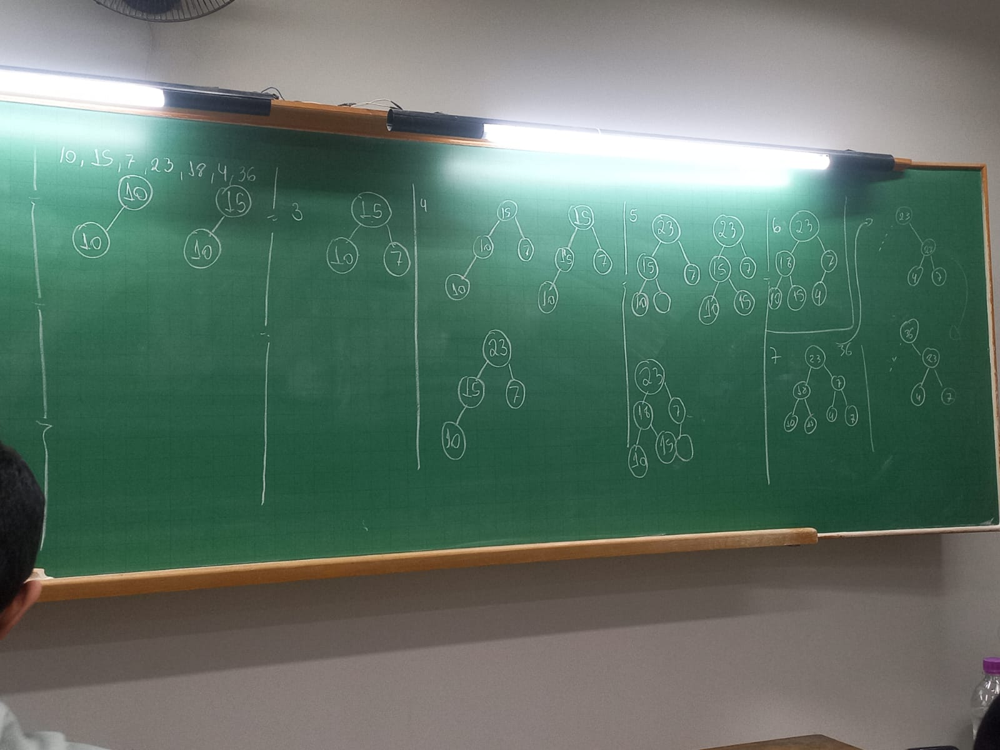
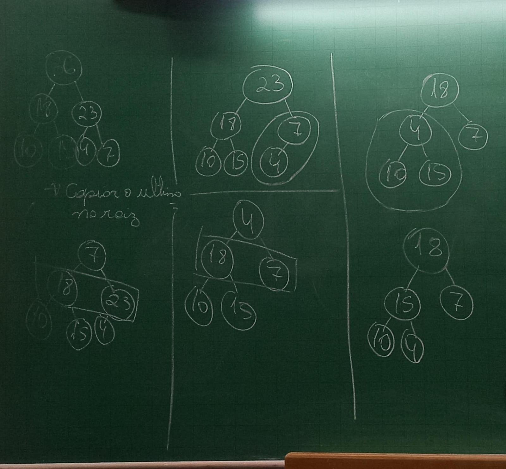

# Filas de prioridade - Heap

## Introdução

- A heap é uma lista de prioridade finita (pode ser implementada como array)
- Cada dado da heap possui uma chave que determina sua prioridade
- A heap é considerada uma árvore completa representada por vetor

## Relembrando

- Uma árvore completa possui as seguintes características:
  - Cada nó possui no máximo dois filhos
  - Os nós que não possuem filhos estão no último ou penúltimo nível
- A heap é preenchida da esqueda para direita

## Como organizar a Heap?

- Utilizando os índices do vetor para organizar a heap
- Chamamos o índices de `i`
- Para encontrar os filhos de `i` fazemos:
  - Filho esquerdo - Fe = `2*i` se `2*i <= n`
  - Filho direito - Fd = `2*i+1` se `2*i <= n`
- Para encontrar pai de `i` fazemos:
  - Pai de `i` - `Pi = i/2` (usa o valor base) se `i > 1`

## Outra características

- Nível dos elemento - `log(i)`
- Altura do elemento - `log(n/i)`
- As Subarvores - pode ser consecutiva ao vetor ou não

## Verifique se os vetores são Heaps

- Em uma heap, todo nó deve ter prioridade maior ou igual a prioridade de seus filhos, se eles existirem
- Dados os vetores onde cada elemento chave é o valor de sua prioridade

```
A1 = {15, 7, 9, 6, 5, 1, 4, 2}
A2 = {15, 7, 9, 8, 5, 10, 4, 2}
```

## Tipo de heap

- Vimos exemplos onde o pai é sempre maior que os filhos
- Chamamos esse tipo de heap de *heap máximo*
- Quando a prioridade do pai é ser sempre menor que os filhos chamamos *heap mínimo*

## Implementação - vamos discutir o heap máximo

- Para facilitar a implementação vamos utilizar o vetor a partir do índice 1
- Logo nosso vetor deve ter o tamanho `n+1`
- As operações
  - Inserir
  - Remover
  - Consultar o elemento de maior prioridade

### Inserir



### Remover 


