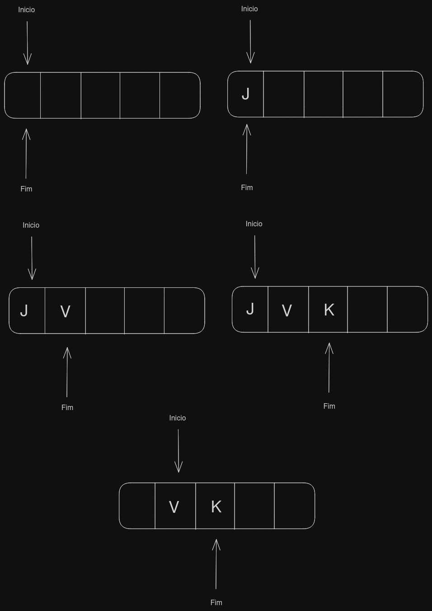

# Fila

- Filas são um tipo de lista

- No cotidiano podem ser encontradas em
	- Mercados
	- RU
	- Disney
	- Banco
	- Rotiador
	- Fila de impressão
	- Gerenciamento de memória

- Filas são estruturas do tipo *FIFO* - *First in First out*.

> As pilhas tem uma outra nomenclatura diferente chamada LIFO - *Last in First out*.

## Fila Circular

- Nesse tipo de estrutura, vamos ter uma variavel que aponta para o inicio da fila e uma que aponta para o final.



```c
void insere(int value) // Insere no final
int remove() // Remove no inicio
int inicio() // Retorna a frente da fila
```

## Filas especiais

- Deques (double ended queue)
	- Fila que permite a inserção e remoção por ambos lados da fila.

## Fila de prioridade

- Prioridade ascendente
	- Menor valor

- Prioridade discendente
	- Maior valor
