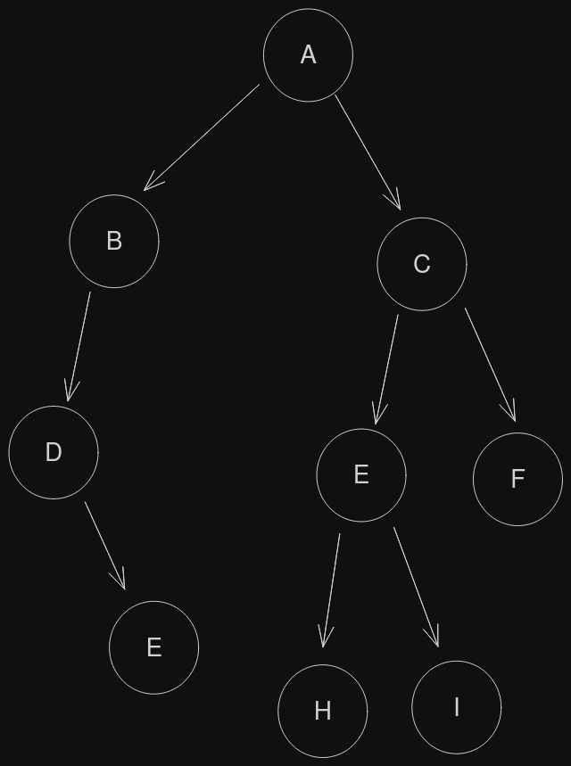
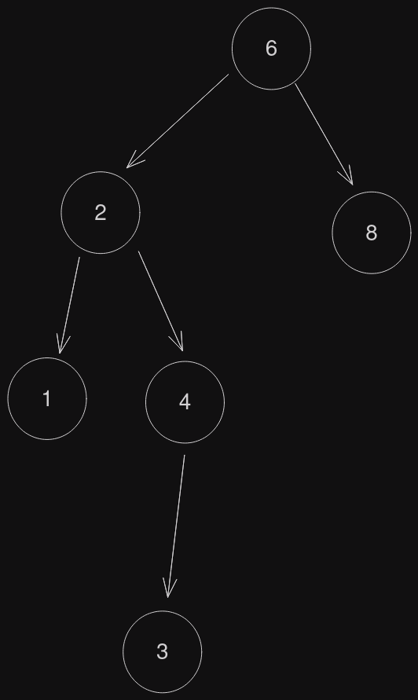
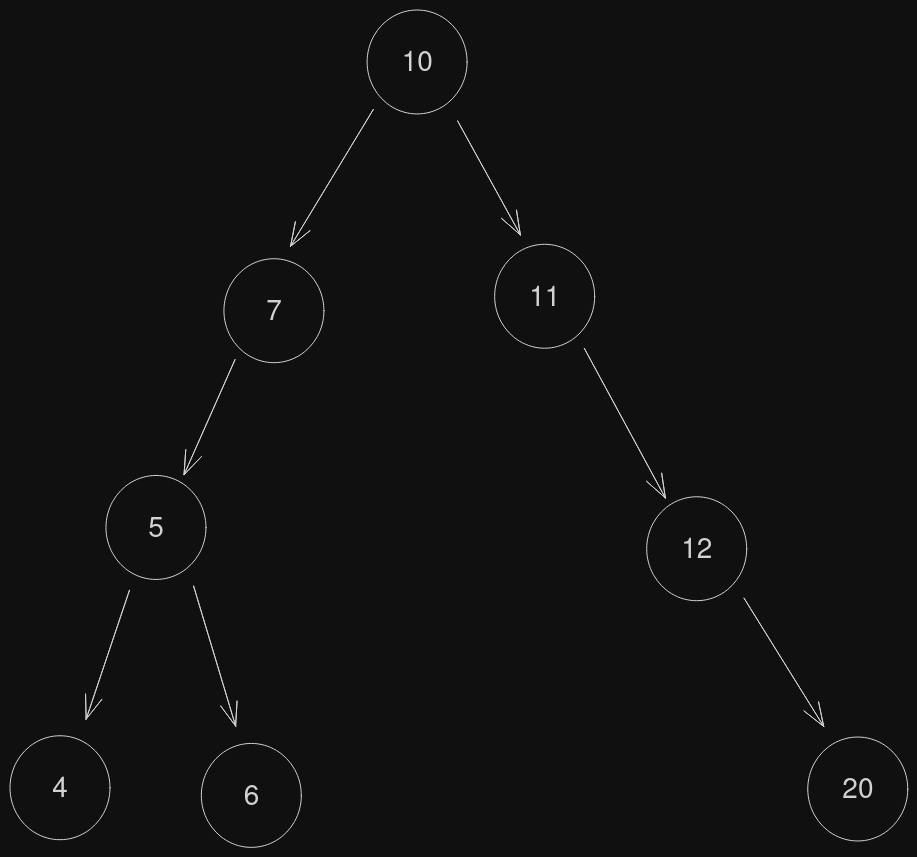
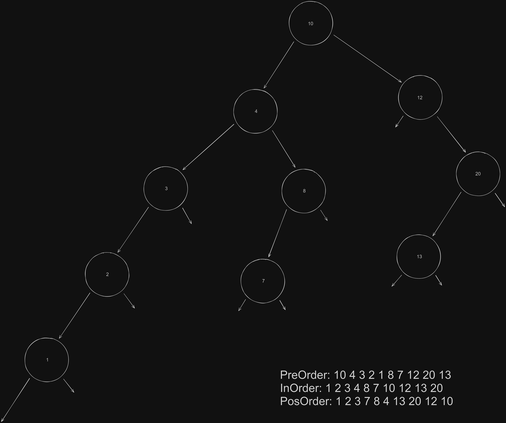

# Árvore binárias II



### Percurso em árvores
	- Existem 3 formas de percorrer a árvore binária
		- Pré-ordem
		- Em-ordem
		- Pós-ordem

#### Pré-Ordem

- Percorre a raiz
- Percorre a sub-árvore da esquerda
- Percorre a sub-árvore direita

```
A,B,D,G,C,E,H,I,F
```

#### Em-Ordem

- Percorre a sub-árvore da esquerda
- Percorre a raiz
- Percorre a sub-árvore direita

```
D,G,B,A,H,E,I,C,F
```

#### Pós-Ordem

- Percorre a sub-árvore da esquerda
- Percorre a sub-árvore direita
- Percorre a raiz

```
G,D,B,H,I,E,F,C,A
```

### Exercício



```
Pré - 6,2,1,4,3,8

Em - 1,2,3,4,6,8

Pós - 1,3,4,2,8,6
```

### Operações básicas em árvores binárias

- Inserir um nó
- Remover um nó
- Consultar a árvore de acordo com o percurso escolhido
- Esvaziar a árvore
	- 10,7,5,11,12,20,4,6


### Inserção

```c
struct no{
	int valor;
	struct no *esq;
	struct no *dir;
}

struct no *raiz = NULL;

void inserir(int valor){
	struct no *aux, *aux2;
	aux = (struct no*)malloc(sizeof(struct no));
	aux->valor = valor;
	aux->esq = NULL;
	aux->dir = NULL;
	if(raiz==NULL){
		raiz = aux;
		return;
	}
	else {
		while(1){
			if(aux->valor<aux2->valor){
				if(aux2->esq==NULL){
					aux2->esq = aux;
					return;
				}
				else {
					aux2 = aux2->esq;
				}
			}
			else {
				if(aux2->dir==NULL){
					aux2->dir = aux;
					return;
				}
				else 	{
					aux2 = aux2->dir;
				}
			}
		}
	}
}

int main(){
	inserir(10);
	inserir(4);
	return 0;
}
```

### Implementação



- [Código utilizado para resolver essa árvore](./exemplo2.c)

> Obs: O código assim está incompleto provavelmente devido ao Autor realizar a implementação real na aula prática então busque pela pasta **"May_10"**, que nela estará o código resolvido.
