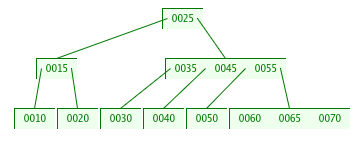
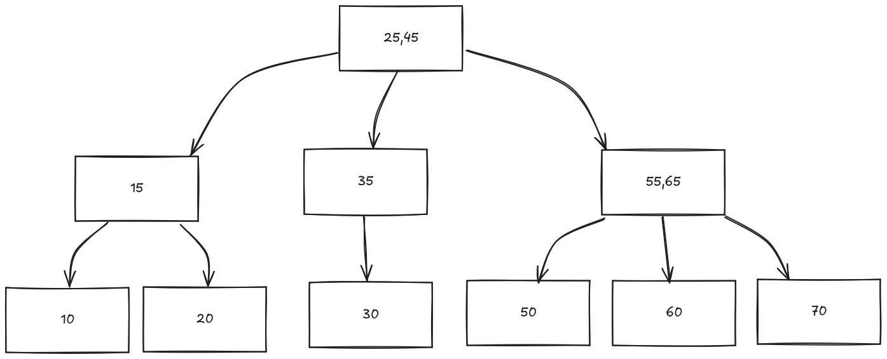

# Árvores Genéricas de Busca

## Árvores múltiplas

O conceito da árvore binária, onde nó aponta para dois nós (direita e esquerda) onde as chaves menores ficam a esquerda e chaves maiores a direita.

Pode-se estender esse conceito para árvores genéricas, nas quais cada nó contém **uma ou mais chaves**.

Uma árvore múltipla de ordem `n` é uma árvore na qual cada nó contém `n`**ou menos subárvores** e contém **uma chave a menos que a quantidade de suas subárvores**

Subárvores podem ser vazias, no sentido de que elas existem, mas não nenhum nó ligado a elas.

Se um nó tiver 4 subárvores, ele terá `3 chaves`.

Logo:
- Se `s1,s2,...,sn` forem as `n` subárvores de um nó contendo as chaves `c1,c2,...,cn-1` ordenadas em ordem crescente
- Todas as chaves da subárvore `s1` serão menores do que `c1`, todas as chaves na subárvore si (onde 2 <= i <= n-1) serão maiores ou iguais a `ci-1` e menores que `ci`, e todas as chaves na subárvore `sn` serão maiores ou iguais a `cn-1`.

## Definições

- **Nó completo**: Contém o número máximo de chaves.
- **Semifolhas**: Nó com pelo menos uma subárvore vazia. 
- **Folha**: Nó com todas as subárvores vazias.

## Balenceamento

Uma árvore múltipla está balanceada quando todas as semifolhas encontram-se no mesmo nível, ou seja, todas as semifolhas são folhas, e todas as subárvores vazias estão no último nível.

## Inserção em B-Tree

Numbers: 10,20,15,30,25,40,35,45,50,55,60,70,65
Degree: 4

Ref: [USFCA](https://www.cs.usfca.edu/~galles/visualization/BTree.html)

### Inserção do professor

