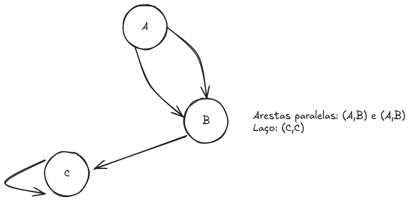

# Grafos

## Introdução 

Muitos dos problemas que proporcionaram o desenvolvimento da teoria de grafos tiveram origem em jogos

### Carteiro Chinês

Relacionado com a questões de encontrar trajetos que percorram todas as arestas de um grafo

Problema posto pelo matemático chinês Mei-Ko Kwan, em 1962

> Um carteiro sai do correio com as cartas para distribuir na sua área. Tem de percorrer todas as ruas pleo menos uma vez e pretende escolher um caminho tão curto quanto possível.

## Exemplo de grafos 

- Relações de colaboraçõa entre pesquisadores.
- Programa orientado a objetos no qual os vértices correspondem às classes definidas no programa e as arestas indicam a herença entre as classes.
- Mapa de uma cidade cujos vértices são cruzamentos ou finais de ruas e cujas arestas podem ser trechos de ruas sem cruzamentos.
- Redes de voo, relativas ao transporte aéreo, cujos vértices correspondem aos aeroportos e cujas arestas são associadas com vôos.

## Definição

**Grafos**: conjuntos de objetos (vértices) junto com uma coleção de conexões entre pares de vértices.

## Termologia

Arestas paralelas ou múltiplas: arestas dirigidas ou não entre o mesmo par de vértices.

## Propriedades

Seja um grafo simples `G` com `n` vértices e `m` arestas. Se `G` for não-dirigido:

- `m <= n(n-1)/2`

Se `G` for dirigido:

- `m <= n(n-1)`

Seja `G` um grafo não-dirigido com `n` vértices e `m` arestas.
- Se `G` for conexo: `m>=n-1`
- Se `G` for uma árvore: `m = n-1`
- Se `G` for floresta: `m <= n-1`
