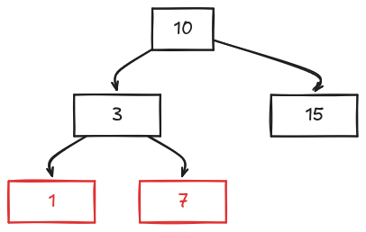

# Árvore Preta Vermelha (Rubro-Negra)

A árvore `RN` é uma árvore binária balanceada

Diferente da AVL a RN pode ter níveis que superam 1 e -1

A RN possui algumas propriedades a serem seguinda baseadas nas cores vermelha e preta

## Definição

1. Propriedade da raiz: a raiz é preta
2. Propriedade dos nós externos: todo nó externo é preto (null ou nil)
3. Propriedade dos nós internos: os filhos de um nó vermelho são pretos
4. Propriedade dos caminhos de un nó qualquer `V`: os caminhos de `V` para seus descendentes nós externos têm o mesmo número de nós pretos

Sim, nesse tipo de árvore contabilizamos o nó `NULL` como preto

## Inserção em árvore vermelha-preta

Para a inserção em uma árvore RN segue o princípio de uma árvore binária comum

## Satisfazendo o item 3

Propriedade dos nós internos: **os filhos de um nó vermelho são pretos** 

Se o pai for preto o item 3 não foi violado

Caso contrário precisamos avaliar o **tio e o avô**

### Entendendo

Supondo que o novo nó seja `n`, o pai `p`, tio `t`, e vô `v`

`p` é vermelho

- Caso 1
    - `t` também é vermelho
- Caso 2
    - `t` é preto

#### Caso 1

Neste caso, trocam-se as cores de `t` e `p` para preto e de `v` para vermelho (a menos que `v` seja a raiz, caso em que será colorido de preto).

#### Caso 2

Neste caso, executa-se uma "reestruturação trinodo", por meio de rotações dos nós e trocas de cores.

- Se `n` é filho esquerdo de um `p` esquerdo em relação ao seu avô
    - Rotação simples direita
- Se `n` é filho direito de um `p` esquerdo em relação ao seu avô
    - Rotação dupla esquerda e direita

## Rotações

As rotações são as mesmas da AVL, porém só muda o caso de uso

## Tempo de execução

Caso | Notação
:-- | --:
Pior caso | O(log2(n))

## Insira em uma árvore RN

- Valores: `10, 7, 15, 3, 1`

