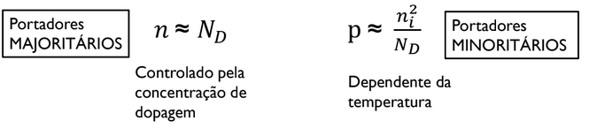
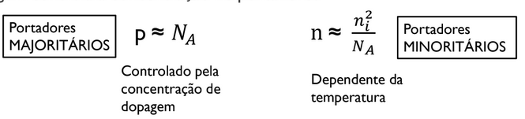

# Teoria dos Semicondutores

## Sumário

- Condutres
- Isolantes
- Semicondutores
- Estrutura Cristalina
- Bandas de Energia
- Portadores de Carga
- Tipos de Dopagem
- Mecanismos de Condução

## Condutores

- "Materiais que permitem o fluxo de corrente elétrica"
- Possuem resistividade elétrica reduzida
- Exemplos?
  - Prata, cobre, alumínio, ouro e outros

Material | Resistividade (ohm * m) | Emprego
:-- | :-: | --:
Prata | 1.64 * 10⁻⁸ | Condutor
Cobre | 1.72 * 10⁻⁸ | Condutor
Alumínio | 2.8 * 10⁻⁸ | Condutor
Ouro | 2.45 * 10⁻8 | Condutor

- Por que isso é possível? Explicação física?
  - A resposta pode ser obtida observando a estrutura atômica dos condutores

- O núcleo positivo atrai os elétros
  - E por que eles não colidem?
    - Movimento orbital *(força centrífuga)* 

- Na eletrônica, o que mais importa é a **CAMADA DE VALÊNCIA**
- O elétro da camada de valência é chamado "elétron livre" e a atração sentida por ele é muito reduzida - facilmente deslocado para um átomo próximo
- Os melhores condutores possuem apenas **UM ELÉTRON** na camada de valência

## Isolantes

- "Materiais que não permitem o fluxo de corrente elétrica"
- Resistividade elétrica elevada
- Possuem entre 6 e 8 elétros na camada de valência
- Exemplos?
  - Plástico, borracha, papel, ar e etc

Material | Resistividade (ohm * m) | Emprego
:-- | :-: | --:
Papel | 10¹⁰ | Isolante
Mica | 5 * 10¹¹ | Isolante
Vidro | 10¹² | Isolante
Teflon | 3 * 10¹² | Isolante

## Semicondutores

- Para entender como os dispositivos eletrônicos *(diodos, transistores...)* funcionam é necessário estudar os **SEMICONDUTORES**
- Materiais com propriedades elétricas **INTERMEDIÁRIAS** às dos Isolantes e dos condutores
- Tipicamente possuem 4 elétrons na camada de valência
- Exemplos?
  - Germânio (final da década de 1940 / início da década de 1950)
  - Silício (dominante hoje em dia)
  - Carbeto de Silício
  - Nitreto de Gálio
  - Diamante (fase inicial de desenvolvimento)

## Estrutura Cristalina

- Quando átomos de silício são combinados forma-se um `cristal` de silício
  - A combinação se dá por `ligações covalentes`
  - O cristal possui uma estrutura regular mantid pelas ligações
- 4 elétros de valência, assim, requer outros 4 para completar a camada
  - Originalmente o átomo possui 4 elétros na CV, mas as ligações passa a ter 8

- Em temperaturas suficientemente baixas *(próximo do zero absoluto)*, o cristal de silício intrínseco comporta-se como um `isolante`
- Nessa condição, todas as ligações covalentes estão intactas e não existem elétros livres para conduzir corrente

- E na temperatura ambiente?
  - Há energia térmica suficiente para quebrar algumas ligações
  - Processo chamado de `ionização térmica`
- Cada ligação rompida dá origem a:
  - Um elétron livre
  - Uma lacuna

## Bandas de Energia

- Qualquer valor de energia térmica cria elétrons *(e lacunas)* livres?
  - Não!!!
  - Para liberar um elétron de uma ligação covalente é necessário um valor mínimo de energia
  - "Energia de Banda Proibida" *(Bandgap energy)* - Eg [eV]
  - Eg é uma propriedade do material

## Portadores de Carga

- Os elétrons livres e as lacunas são chamados de `portadores de carga`
- Esse nome decorre do fato de que os elétrons livres e as lacunas transportam cargas de um lugar para o outro

- O elétron livre pode se afastar do seu átomo pai e ficar disponível para conduzir corrente
- Elétron se afasta do átomo pai:
  - É deixado para trás uma carga líquida positiva
  - Outro elétron pode ser atraído pela carga positiva, preenchendo a `lacuna`
  - Porém, outra lacuna é criada no ´tomo ionizado e o processo repete...
- Quanto `maior` a temperatura, mais ligações são quebradas e `pares elétron-lacuna` são gerados - Maior a condutividade

- **Geração:** quebra de ligações covalentes, gerando pares elétron-lacuna
  - Requer energia *(térmica ou óptica)* de fontes externas

- **Recombinação:** formação de uma ligação covalente através do preenchimento de uma lacuna com elétron livre
  - Libera energia térmica ou óptica
  - `SÃO PROCESSOS ANÁLOGOS`

- Taxa de geração *(ou ionização)* = G(T) [cm⁻³s⁻¹]
- Taxa de recombinção = R(T) [cm⁻³s⁻¹]

- Muito dependentes da temperatura!

- Em equilíbrio térmico:
  - G(T) = R(T)
- Ou seja, a concentração de elétrons livres *(n)* é igual a concentração de lacunas *(p)*
  - n = p = ni
  - ni é concentração de elétrons livre e lacunas em um volume unitário de silício intrínseco a determinada temperatura

```
              - Eg / kT
ni² = BT³ * e

```
- Em que:
  - B: Parâmetro dependente d material. ≃ 5.4 * 10³¹ para silício
  - T: Temperatura *(K)*
  - Eg: Parâmetro do material. ≃ 1.12 eV para o silício
  - k: Constante de Boltzmann. = 8.62 * 10⁻⁵ eV/K
- Qual a concentração para silício em temperatura ambiente *(T ≃ 300K)*?
  - ni = 1.5 * 10¹⁰ portadores/cm³

## Tipos de Dopagem

- Dopagem
  - Introdução de átomos *"estranhos"* para modificar as propriedades elétricas do semicondutor
  - O semicondutor dopado torna-se `impuro`
  - Um cristal de silício impuro é chamado de `EXTRÍNSECO`

- Em semicondutores intrínseco as concentrações são pequenas *(a temperatura ambiente)* e muito dependentes da temperatura
- A dopagem é utilizada para alterar a concentração de portadores em um cristal semicondutor de forma precisa e controlada

- Pode ser aumentada a concentração de elétrons livres ou lacunas com poucas ou nenhuma alteração nas propriedades do cristal
- A dopagem pode ser:
  - **Tipo n:** aumenta a concentração de elétrons livres
  - **Tipo p:** aumenta a concentração de lacunas

- Para o `silício` as dopagens são realizadas das seguintes formas:
  - `Tipo n` - é adicionado elemento do grupo V da tabela periódica *(5 elétrons na camada de valência)*. Ex: Fósforo
  - `Tipo p` - é adicionado elemento do grupo III da tabela periódica *(3 elétrons na camada de valência)*. Ex: Boro

- Elementos `pentavalentes` são também chamandos de **DOADORES** *(de elétrons livres)*

- Semicondutor dopado `tipo n`:
  - 4 elétrons do doador formam ligações
  - E 0 elétron restante é livre

> OBS: nenhuma lacuna pe gerada pela dopagem

- Define-se Nd a concentração de doadores [cm⁻³]
- Se Nd << ni:
  - Semicondutor intrínseco
- No entanto, se Nd >> ni:
  - A dopagem controla a concentração de portadores



- Elementos `trivalentes` são também chamados de **ACEITADORES** *(de elétrons livres)*

- Semicondutor dopado `tipo p`:
  - 3 elétrons do aceitador formam ligações
  - Cada aceitador *"libera"* uma lacuna

> OBS: nenhum elétron é adicionado pela dopagem

- Define-se Na a concentração de aceitadores [cm⁻³]
- Se Na << ni:
  - Semicondutor intrínseco
- No entanto, se Na >> ni:
  - A dopagem controla a concentração de portadores


