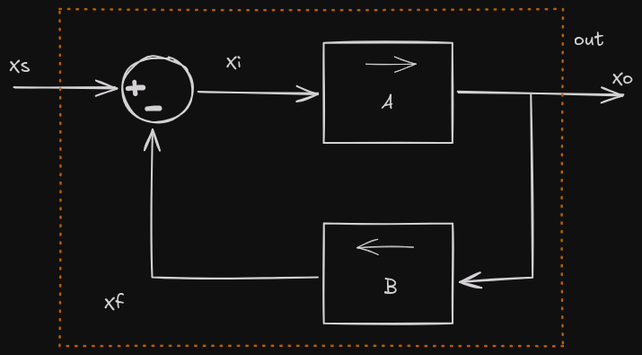

# Circuitos de Realimentação

- Amplificadores
- Osciladores

Realimentação
- Negativa (Amplificadores)
- Positiva (Osciladores)

## Amplificadores Realimentados



A -> Ganho de malha aberta

B -> Fator de realimentação

Xo/Xs = Af -> Ganho de malha fechada

```
Xo = Axi
    xi = Xs - Xf
Xo = A(Xs - Xf)
            Xf = BXo
Xo = A(Xs - BXo)
Xo + BAXo = AXs
Xo(1+BA) = AXs
Xo/Xs = A/1+BA = Af

=> Af ≃ 1/B
```

## Exemplo:

* p/ Amin = 1000
    * Af = 1000/1+(0.1 * 1000) => 1000/101 = 9.9009

* p/ Amax = 10000
    * Af = 10000/1+(0.1*10000) => 10000/1001 = 9.9900


* Af ≃ 1/0.1 = 10

## Osciladores


* Af(s) = A(s) / 1 - A(s)B(s)

## Exemplo Oscilador em ponte de Wien

fo = 100 KHz

R1 = R2 = R

C1 = C2 = C

fo = 1 / 2πRC

Rf = 2Rg

