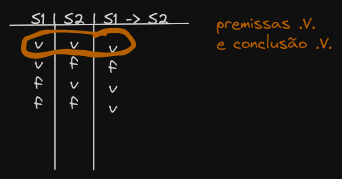
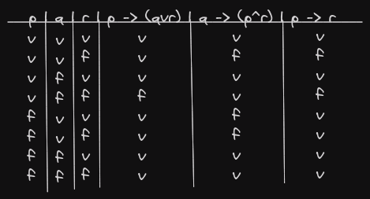
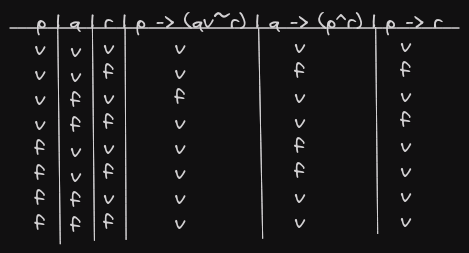
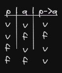
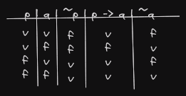

# Argumentos e consequência lógica

## Legenda

> *:.*  -> Implica

> *F* -> Gama

> *&* -> Alpha

> *B* -> Beta

## Exemplo de argumneto

- Se Sócrates é humano (S1), Sócrates é mortal (S2). *(implicações factuais)*
- Sócrates é humano *(fatos)*

> Conclusão -> *Sócrates é mortal*

> *S1, S1*(Premissas, hipótese, axiomas, suposições, fatos) -> S2 :. S

## Definição de Argumento:

- Um argumento é uma sequência de proposições que podem ser representadas por sentenças em lógica (*fbl*). Todas as sentenças que formam um argumento, exceto a última, são chamadas de premissas. A última é denominada conclusão.
- Sejam P1, P2, ..., Pn um conjunto de proposições, premissas, e C a proposição consenquente. 

> Um argumento tem a forma: P1, P2, ..., Pn :. C.

- Um argumento pe válido se, e somente se a proposição C é verdadeira sempre que a *(conjunção)* das premissas é verdadeira.

## Usar a tabela verdade para testar a validade de um argumento.

## Exercício 1

- Seja P, Q e R três variaveis proposicionais que representam sentenças declarativas (proposições). Verifique que se a expressão abaixo, que representa um argumento, é valido.

- P -> (Q v R), Q -> (P ^ R) :. P -> R

- Dizemos que *P -> (QvR), Q -> (P^R)*(&) :. *P -> R*(B)

> & implica lógicamente em B. E B é consequencia lógica de &

## Exercício 2

- Verifique se P -> R é consequência lógica de P -> (Qv~R) e Q -> (P^R).

- P -> (Qv~R), Q -> (P^R) !:. P -> R. *(Não implica lógicamente)*.

## Definições

### Consequência lógica (implicação lógica)

- UMa sentença S0 é consequência lógica de um conjunto de fórmukas F = {S1, S2, ..., Sn}, se S0 tem valor verdade .V. sempre que todas as sentenças de F tem valor .V.

> F :. S0. S1, S2, ..., Sn :. S0.

#### Exemplo

- p, p -> q :. q

- Um modelo são instaciações que tornam sentenças verdadeiras.

## Definição de Modelo

- Um modelo m para uma sentença lógica S é uma combinação de valores verdade para as variáveis de S que produz o valor verdade .V. para S.

- **Definição**: M(S) é o conjunto de tdos os modelos de S.
- **Definição**: Consequência lógica F :. S se todo modelo para F é um modelo para S. Ou ainda F :. S  M(F) <= M(S)

## Satisfatibilidade

- Uma sentença S é satisfatível se M(S) não é vazio. Existe no mínimo um modelo para S.

### Satisfatibilidade e consequência lógica

- F :. S se, e somente se cada modelo que satifaz F também satifaz S.

## Insatisfatibilidade

- S é insatisfatível se M(S) = 0
- Um argumento P1, P2, ..., Pn :. C é válido se S1, S2, ..., Sn :. S. Dada que Si representa Pi, i = 1...n, e S representa C.

### Exemplo

- A seguir modelos satisfatíveis

## Exercícios

- Verifique se o argumento abaixo é válido.

> Se `Antonio é um bebê`, ele `é infantil`. `Ninguém é anônimo`, se conseguir `dominar um crocodilo`. Se `Antonio é infantil`, ele `é anônimo`. Logo se `Antonio é um bebê`, ele não `domina um crocodilo`.

- P -> Q, R -> S,  Q -> R, P -> ~S.

### Resolução

1. Antonio é um bebê
2. Antonio é infantil
3. Antonio domina um crocodilo
4. Antonio é anônimo

- P -> Q; R -> ~S; Q -> S; P -> ~R;

# Teorema da Dedução

- Para qualquer par de sentenças & e B, & implica lógicamente em B, se e somente se & -> B é uma tautologia.
- Para qualquer par de sentenças & e B, & implica lógicamente em B, se e somente se & ^ ~B é uma contradição. Isto é, & ^ ~B é insatisfatível.
