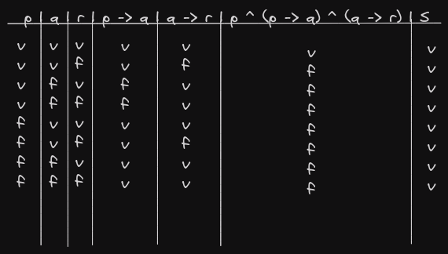
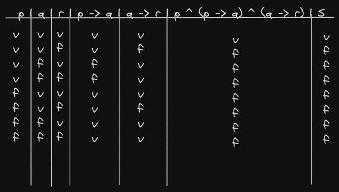
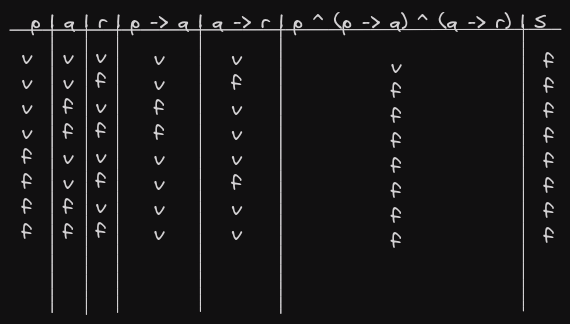
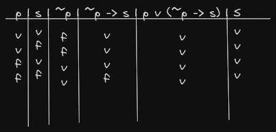

# Determine o valor verdade das seguintes expressões proposicionais:

1. (p ^ (p -> q) ^ (q -> r)) -> r
2. (p ^ (p -> q) ^ (q -> r) ^ r)
3. (p ^ (p -> q) ^ (q -> r) ^ ~r)
4. (p v (~p -> s)) v s
5. (p ^q) ^ (~(p ^ q))

## Resultados

1. 

2.

3.

4.

5.

