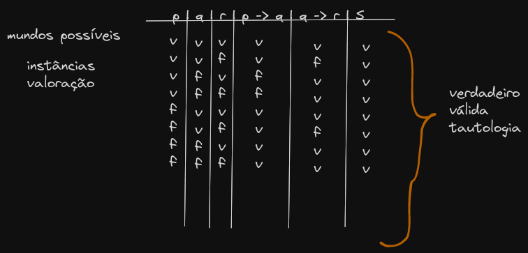
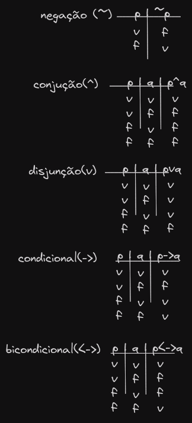

# Sintaxe da lógica proposicional

- A sintaxe da lógica proposicional contém um conjunto de regras para produzir sentenças (expressões).
- Tais sentenças são elitas fórmulas bem formadas (fbl).

> Denote uma senteça por S.

> S -> Sa | Sc *(atômica | composta)*

> Sa -> p | q | r | ... | p1 | p2 | pn | .V. | .F. | *(verdadeiro e falso)*

> Sc -> (S) | ~S | (S1 ^ S2) | (S1 v S2) | (S1 -> S2) | (S1 <-> S2)

- **Ex:** ((p^q) -> (RvS)) != (((p^q) -> R)v S)

- Precedência de operadores ~, ^, v, ->, <->

# Semântica da lógica proposicional

- **Obj.** Dada uma sentença verificar se sua verdade pode ser derivada. S -> .V. v .F.
- Associamos as variáveis a dois valores:

1. .V.: verdadeira
2. .F.: falsa

- **Obj:** prova de argumentos
- `x é bom`, se x é bom então `vai para o céu`

> p, p -> q

- A prova de um argumento tem como objetivo verificar-se sua conclusão é verdadeira sempre que as premissas também são. Operacionalmente isso pode ser feito analisando os resultados de cada sentença em termos de valor verdade (.V. ou .F.). Os resultados de um sentença podem ser derivados a partir dos valores das variáveis que a compõem.

> **Ex.** Se `você obter muitos valores dobrados`, `perderá`, ou se perder, `ficará endividado`.

- (p -> q) v (q -> r)

- Para responder essa questão podemos usar um recurso (denotacional/formal) chamado tabela verdade.
- O emprego de tabelas verdades permite determinar o valor verdade de uma sentença S a partir do valor verdade das sentenças e variáveis que compõem S.

## Definição de como interpretar cada operador?

- Uma tabela verdade tem uma linha para cada combinação de valores das variáveis que aparecem na proposição S. Ela também possui uma coluna para cada variavel de S, uma coluna para a sentença S e, possivelmente, colunas para as sentenças que compõem S. Usualmente, a última coluna está associda a S. Cada linha da tabela verdade especifica uma certa combinação de valores das variáveis de S;
- Está valoração conjunta é denominada *Mundo Possivel* ou *Instância*. As demais colunas contém o valor verdade das sentença que foi derivada de acordo com os operadores.

# Tabela verdade das operadores lógicos

