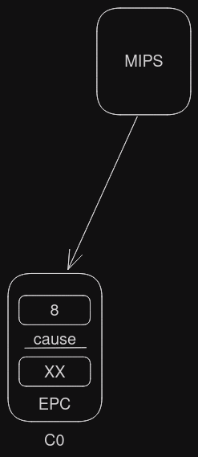

# Chamadas de Sistema - (system calls)


## Mapa de memória MIPS (Memory Maps)


### Exemplo de uso de syscall:

- [Código em .asm](./Exemplo0.asm)

```Assembly
.data
	msg: .asciiz "Olá mundo!"
.text
	main: 	la $a0, msg
		
		li $v0, 4
		syscall
		li $v0, 10
		syscall
```

- Explicação do que acontece quando executado esse código



## Ler um inteiro a partir do teclado

[Lendo um número inteiro](./Exemplo1.asm)

```Assembly
.text
	main:	li $v0,1
		syscall
		# $a0 <- Valor lido
```

## Em arquitetura x86

- x86/Linux

```Assembly
mcv rax, 60 
mcv rde, 0 # arquitetura x86/Linux
syscall # syscall exit
```

- x86/16 bits

```Assembly
mcv ah, 02
mcv dl, 41
int 21
```
