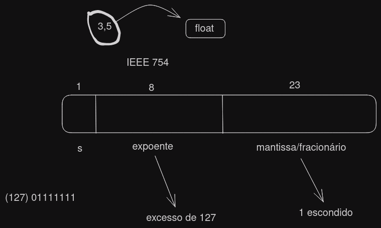
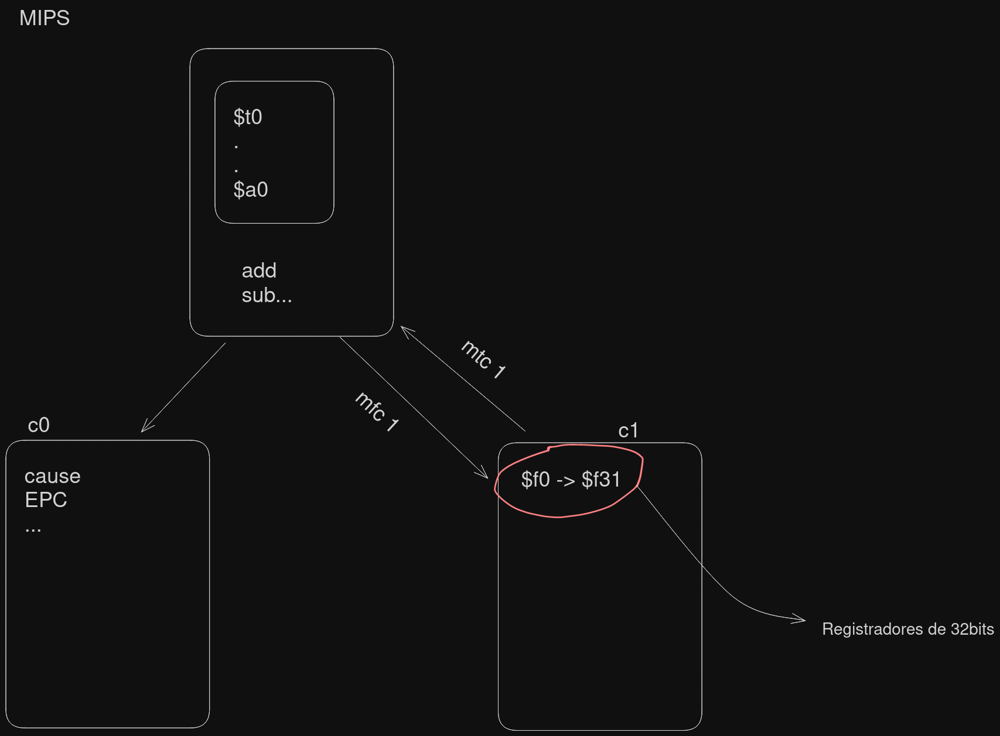

# Vírgula flutuante (Ponto flutuante) - Float



[Site para ver calcular o número float](https://www.h-schmidt.net/FloatConverter/IEEE754.html)

##### Exemplo 1

```
1,f * 2^e

3,5 / 2 = 1,75 } 1 divisão

0,75 * 2 = 1,5	1
0,5 * 2 = 1,0	1
0 * 2 = 0	0
```

##### Exemplo 2

```
8,3

8,3 / 2 = 4,15
4,15 / 2 = 2,075	} 3 + 127 = 1000 0010
2,075 / 2 = 1,0375

0,0375 * 2 = 0,075	0	22
0,075 * 2 = 0,15	0	21
0,15 * 2 = 0,3		0	20
0,3 * 2 = 0,6		0	19
0,6 * 2 = 1,2		1	18
0,2 * 2 = 0,4		0	17
0,4 * 2 = 0,8		0	16
0,8 * 2 = 1,6		1	15
0,6 * 2 = 1,2		1	14
0,2 * 2 = 0,4		0	13
0,4 * 2 = 0,8		0	12
0,8 * 2 = 1,6		1	11
0,6 * 2 = 1,2		1	10
0,2 * 2 = 0,4		0	09
0,4 * 2 = 0,8		0	08
0,8 * 2 = 1,6		1	07
0,4 * 2 = 0,8		1	06
0,8 * 2 = 1,6		0	05
0,6 * 2 = 1,2		0	04
0,2 * 2 = 0,4		1	03
0,4 * 2 = 0,8		0	02
0,8 * 2 = 1,6		1	01
```

## No MIPS 



##### Exemplo de comandos

```Assembly
add.s $f0, $f1, $f2
mult.s $f0, $f3, $f4
mtc1 $t0, $f0
cvt.s.w $f0, $f0
mfc1
```

##### Exemplo de código
```Assembly
.data
	pi: .float 3.1415

.text
	la $s0, pi
	lwc1 $f0, 0($s0)
```
