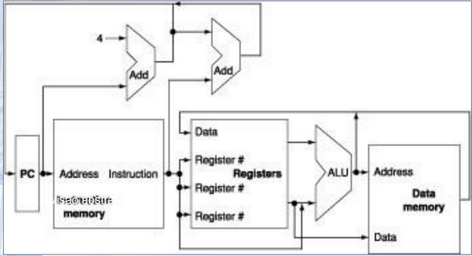
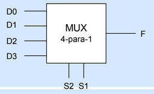
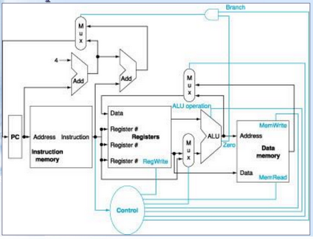
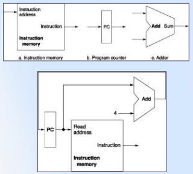

# Microarquitetura: Caminho de dados e controle para processador MIPS

## Introdução

- Implementação do MIPS simplificada:
  - Instruções de referência à memória(`lw` e `sw`)
  - Instruções lógicas e aritméticas(`add`, `sub`, `and`, `or`, `slt`)
  - Instruções de controle de fluxo(saltos) `beq` e `j`
  - Memória de intruções e memória de dados separadas

- `lw $t1, offset($t2)`
  - Load word
  - `$t1` = valor armazenado na posição de memória `$t2 + offset`
- `sw $t1, offset($t2)`
  - Store word
  - posição de memória `[$t2 + offset] = $t1`

- `beq $t1, $t2`, endereço
  - Branch if equal(salte se igual)

## Uma sinopse da implementação

- Todas as instruções do conjunto de instruções têm os dois primeiros passos idênticos:
  - Enviar o valor armazenado no PC para memória de programa e buscar a instrução dessa memória
  - Ler um ou dois registradores, usando os campos de instrução para selecionar os registradores a serem lidos. Para a instrução `load word`, precisamos ler apenas um registrador, mas a maioria das outras instruções exige a leitura de dois registradores
- Mesmo entre diferentes classes de instruções, há algumas semelhanças:
  - Todas as classes utilizam a UAL após a leitura dos registradores:
    - Instruções de referência à mémoria: efetuar o cálculo do endereço
    - Instruções aritméticas e lógicas: efetuar a operação
    - Desvios condicionais: efetuar comparação (subtração)
- Após usar UAL, as ações necessárias diferem
  - Referência a memória: escreve dado na memória
  - Instrução aritmética: escreve dado no registrador

## Uma visão abstrada da implementação do subconjunto MIPS mostrando as unidades funcionais principais e as conexões principais

## Multiplexador ou seletor de dados

- Barramento de controle
  - Operações devem ser selecionadas através de multiplexadores
  - Circulo com `2^n` linhas de entradam `n` linhas de controle e 1 saída
  - Seleciona uma única saída a partir de várias entradas, sendo a entrada escolhida é copiada para saída

S2 | S1 | F
:-- | :-: | --:
0 | 0 | D0
0 | 1 | D1
1 | 0 | D2
1 | 1 | D3

## A implementação básica do subconjunto MIPS incluindo as linhas de controle e os multiplexadores necessários

## Método de temporização (clocking)

- Clocking
  - Define quando os sinais podem ser lidos e quando podem ser escritos
  - Evitados circunstâncias onde um sinal é lido ao mesmo tempo que o mesmo sinal foi escrito; a leitura pode retornar o valor antigo, o valor recente ou uma combinação entre dois
- Sincronização acionada por transição
  - Significa que quaisquer valores armazenados em um elemento lógico sequencial são atulizados apenas em uma trasição de clock
  - Como apenas os elementos de estado podem armazenar valores de dados qualquer coleção de lógica combinatória precia ter suas entradas vindo de um conjunto de elemntos de estado e suas saídas escritas em um conjunto de elementos de estado

## Construindo o caminho de dados

- Elementos principais do caminho de dados
  - PC, memória de instruções e somador

