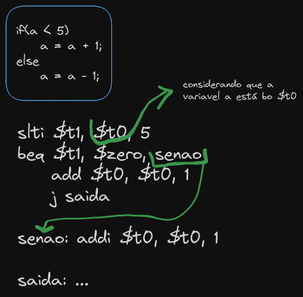
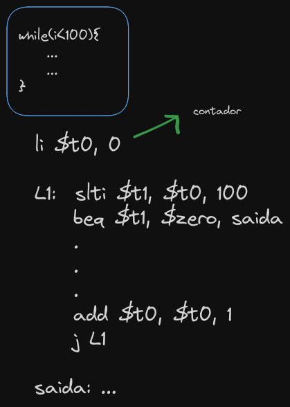

# Instruções para tomada de decisão: instruções de comparação e desvio.

### Exemplo de alto nível:

```c
if(a == 0){
	a = a + 5;
}
else {
	a = a + 1;
}
```
- Em Assembly exite três instruções importantes para comparações e desvio:

> *beq* - (**b**ranch if **eq**ual)

> *bne* - (**b**ranch if **n**ot **e**qual)

> *j* - **jump** (salto incondicional)

### Exemplo em baixo nível:

- Utilizando o **beq**, isso acontece: "Se $t0 for verdadeiro *salte* para o *entao*, Se for falso, continue com o código e depois da execução *pule* para o *saida*".

```Assembly
# $t0 <- a

beq 	$t0, $zero, entao
	addi $t0, $t0, 1
	j saida

entao: addi $t0, $t0, 5

saida: # ...
```

- Utilizando o **bne**, isso acontece: "Se $t0 for verdadeiro continue com o código e depois das operações *pule* para *saida*, Se for falso, chame *senao* e faça a operação".

```Assembly
# $t0 <- a

bne 	$t0, $zero, senao
	addi $t0, $t0, 5
	j saida

senao: addi $t0, $t0, 1

saida: # ...
```

### Como resolver um problema assim?

```c
if(a<5){
	a = a + 1;
}
else {
	a = a - 1;
}
```

- Para resolver isso vamos usar duas instruções *slt* e a *slti*

> *slt* (**s**et **l**ess **t**han)

> *slti* (**s**et **l**ess **t**han **i**mmediate)

- Exemplo *slt*:

```Assembly
slt $t1, $t0, $t2 # $t1 <- 1 se $t0 < $t2
```

- Exemplo *slti*:

```Assembly
slti $t1, $t0, $32 # $t1 <- 1 se $t0 < 32
```
### Exemplo de estrutura de decisão "if e else" em Assembly:



### Exemplo de estrutura de repetição "Enquanto" em Assembly:


