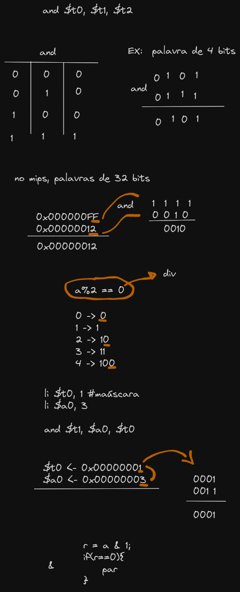
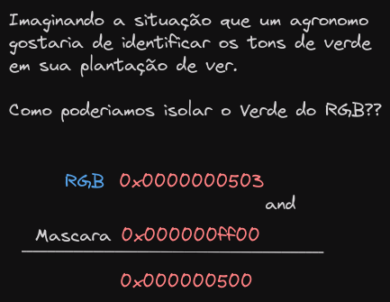

# Operações lógicas

- and | and
- or  | or
- xor | xor
- not | nor



## Detector se o número é potencia de 2

- 2⁰= 1 - 0000 1111
- 2¹= 2 - 0010 0001
- 2²= 4 - 0100 0011
- 2³= 8 - 1000 0111
- 2⁴= 16 - 1000 0111

### $a0 potencia 2?

```assembly
sub $t0, $a0, 1
and $t1, $a0, $t0

# $t1 == 0 => potencia de 2

xor $t0, $a0, $a0
```

# Deslocamento de bits

- Deslocamento a esquerda:

- | 0 | 0 | 0 | 1 | *Exemplo palavra 4 bits*
- | 0 | 0 | 1 | 0 | *Deslocamento a esquerda*

- Deslocamento a direita:

- | 1 | 0 | 0 | 0 | *8 na base 10*
- | 0 | 1 | 0 | 0 | *4 na base 10*

- n/2d => 8/2.1 = 4
- x = a * 2;

```assembly
sll $t0, $a0, 2
```

> sheft logical left

```assembly
li $a0, 4
sll $t0, $a0, 2
```

- $t0 = ?

- **srl** - *srl $t0, $a0, 3*


