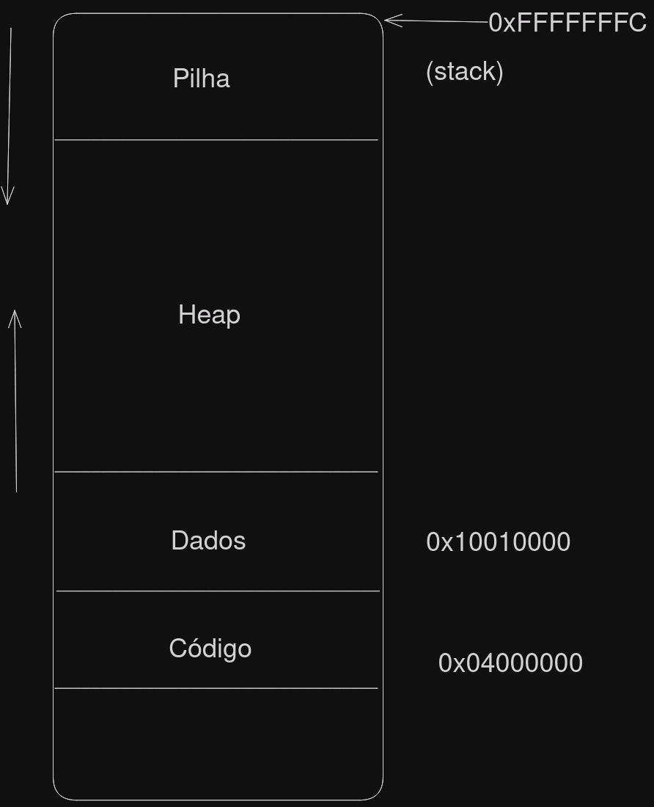
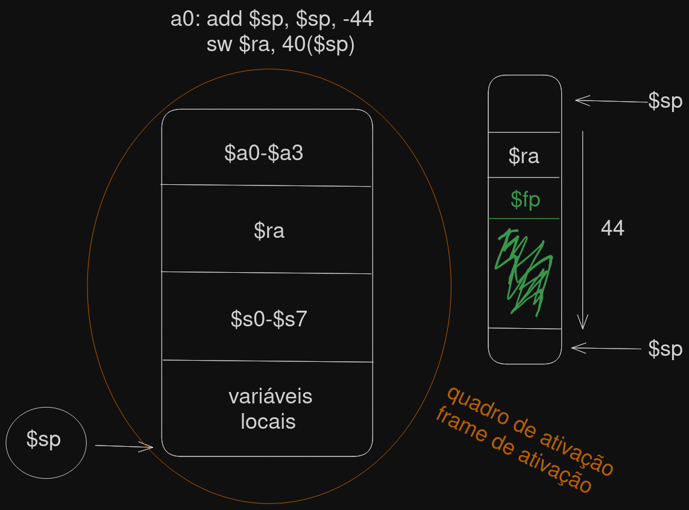

# Suporte em hardware para Procedimentos

- **jal**: (jump and link)
- **jr**: (jump registor)



## Exemplos

### Exemplo JAL para soma

```Assembly
...
	la $s0, x
	li $a0, 5	# } $a0 -> $a3 (argumentos)
	li $a1, 2	# }
	jal soma
	sw $v0, 0($s0)
	li $v0, 10
	syscall

	soma:	add $v0, $a0, $a1 # } $v0-$v1 (retorno)
		jr $ra
```

### Exemplo com mais de um procedimento

```Assembly
# (Código errado)
	la $s0, x
	li $a0, 5
	li $a1, 2
	jal soma
	sw $v0, 0($s0)
	li $v0, 10
	syscall

	somaI:	add $v0, $a0, $a1
		add $a0, $zero, $v0
		jal imprime
		jr $ra
	
	somaC:	add $sp, $sp, -4
		sw $ra, 0($sp)
		add $v0, $a0, $a1
		add $a0, $zero, $v0
		jal imprime
		lw $ra, 0($sp)
		add $sp, $sp, 4
		jr $ra

	imprime:li $v0,1
	syscall
	jr $ra
```

### Exemplo soma3

```
0	li $a0, 5
4	li $a1, 2
8	li $a2, 3
12	li $a3, 7
16	add $sp, $sp, -4
20	li $t0, 10
24	sw $t0, 0($sp)
28	jal soma
32
36	soma:	add $sp, $sp, -4
40		sw $ra, 0($sp)
44
48		add $v0, $a0, $a1
52		add $v0, $v0, $a2
56		add $v0, $v0, #a3
60		lw $t0, 4($sp)
64		add $v0, $v0, $t0
68		lw $ra, 0($sp)
72		add $sp, $sp, 4
76		jr $ra
```
### Exemplo de soma com procedimento
```Assembly
.data 

	vetor: .word 2, 4, 8, 10 , 12, 16, 18
	tam: .word 7
.text

.globl main

main:

	# preparando os argumentos
	la $a0, vetor
	la $a1, tam
	lw $a1, 0($a1)

	jal soma
	

	move $a0, $v0
	li $v0, 1
	syscall
	

	li $v0, 10
	syscall


soma: 
		addi $sp, $sp, -4
		sw $ra, 0($sp)

		li $t0, 0
		li $v0, 0

		L1: 	beq $t0, $a1, fim
			sll $t1, $t0, 2
			add $t1, $t1, $a0
			lw $t1, 0($t1)
			
			add $v0, $v0, $t1
			addi $t0, $t0, 1
			j L1


		fim:
			lw $ra, 0($sp)
			addi $sp, $sp, 4
			jr $ra
```


