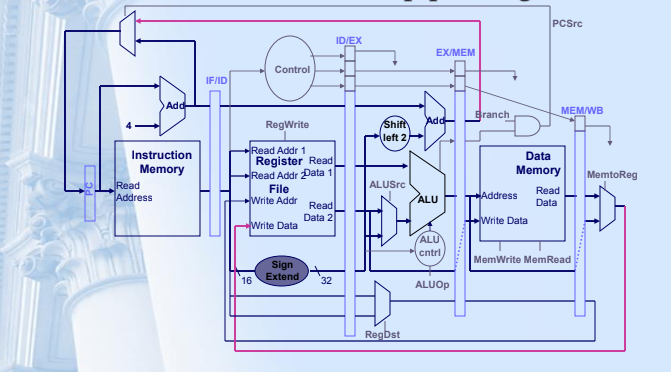
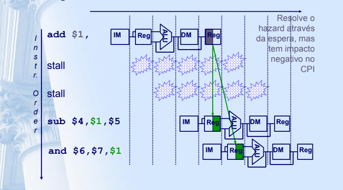
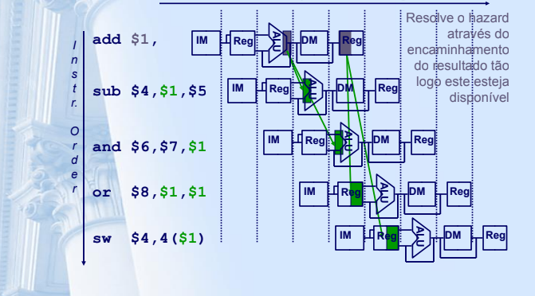
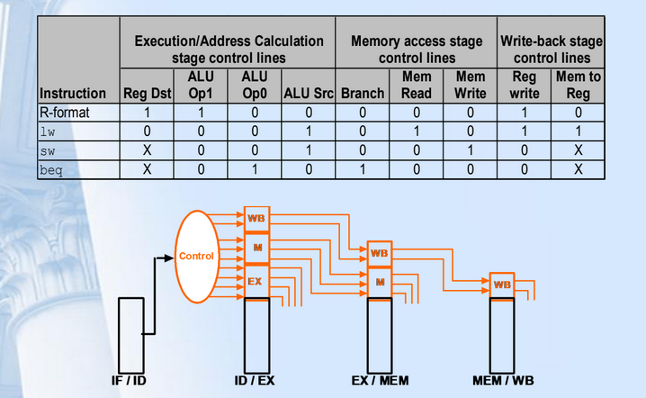
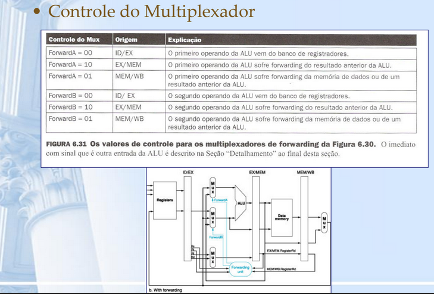
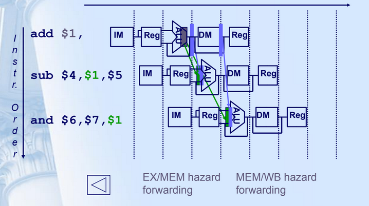
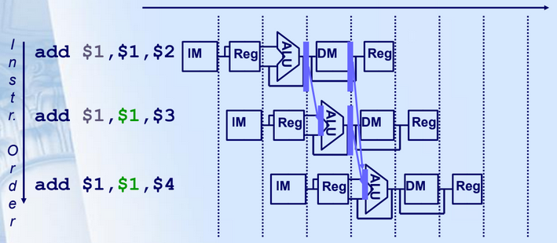

# Solucionando Harzards no pipeline







## Implementação de encaminhamento

Encaminhamento (forwarding)

- A Implementação do *forwarding* necessita de uma forma de identificar o hazard
- Deve-se coletar o resultado dos registradores de pipeline e realizar o encaminhamento para a ALU que necessita de dados
    - Para a ALU, as entradas vem de quaisquer registradores de pipeline ao invés do registrador ID/EX
    - Multiplexadores são adicionados nas entradas da ALU para selecionados os dados corretos
    - Adiciona-se um controle de hardware apropriado para controlar os novos multiplexadores
    - Outras unidades funcionais, como DM, necessitam de uma lógica similar
- Com *forwarding*, é possível atigir um CPI igual a 1 mesmo quando existirem dependências de dados





## Condições para deteccção de hazard de dados

```vhd
EX/MEM hazard:
if (EX/MEM.RegWrite
and (EX/MEM.RegisterRd !=0)
and (EX/MEM.RegisterRd = ID/EX.RegisterRs))
    ForwardA = 10
if(EX/MEM.RegWrite
and (EX/MEM.RegisterRd !=0)
and (EX/MEM.RegisterRd = ID/EX.RegisterRt))
    ForwardB = 10
MEM/WB hazard:
if (EX/WB.RegWrite
and (EX/WB.RegisterRd !=0)
and (EX/WB.RegisterRd = ID/EX.RegisterRs))
    ForwardA = 01
if(EX/WB.RegWrite
and (EX/WB.RegisterRd !=0)
and (EX/WB.RegisterRd = ID/EX.RegisterRt))
    ForwardB = 01
```



## Outra complicação

Outro potencial *data* hazard pode ocorrer quando existe um conflito entre o resultado do estágio WB e o estágio MEM - qual resultado de ser encaminhado?


