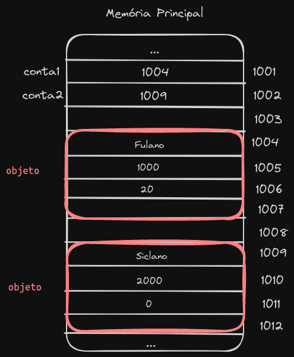
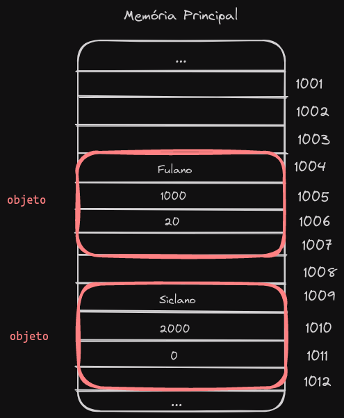
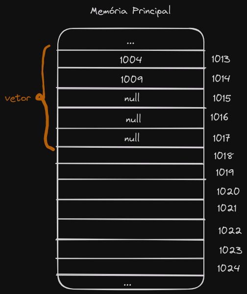

# Java memória

## Como funciona a memória?

- Na memória quando colocamos o nome da class para reservar espaço na memória:

```java
public class Principal {
	public static void main(String[] args){
		ContaCorrente conta1, conta2;
	}
}
```

- Quando criado essa instancia, na memória são reservados duas celulas para referenciar o objeto.

> Então vamos dizer que a **conta1** e **conta2** estão no endereço *1001* e *1002* respectivamente. E dentro deles possui o valor *null*. 

- Agora vamos criar os objetos, para representar melhor ainda como vai ficar na memória:

```java
public class Principal {
	public static void main(String[] args){
		ContaCorrente conta1, conta2;
		
		conta1 = new ContaCorrente("Fulano", 1000, 20);
		conta2 = new ContaCorrente("Siclano", 2000, 0);
	}
}
```

- Aqui o que vai acontecer é que na **conta1** e **conta2** vão receber o valor da referencia, onde está localizado o objeto na memória.

### Exemplo em desenho:



## Comparando Objetos em Java

- Código para o exemplo:
```java
public class Principal {
	public static void main(String[] args){
		ContaCorrente conta1, conta2;
		
		conta1 = new ContaCorrente("Fulano", 1000, 20);
		conta2 = new ContaCorrente("Fulano", 1000, 20);
	}
}
```


- Se você comparar objetos em Java, não faça dessa forma:

```java
if(conta1 == conta2) System.out.println("Iguais");
else System.out.println("Diferentes");

// Result: Diferentes
```

- O jeito correto é utilizar *equals()*:
```java
if(conta1.equals(conta2)) System.out.println("Iguais");
else System.out.println("Diferentes");

// Result: Iguais
```


## Vetores em Java

- Código de exemplo:

```java
public class Principal {
	public static void main(String[] args){
		ContaCorrente vetor[];

		vetor = new ContaCorrente[5];
		vetor[0] = new ContaCorrente("Fulano", 1000, 20);
		vetor[1] = new ContaCorrente("Siclano", 2000, 10); 
	}
}
```




