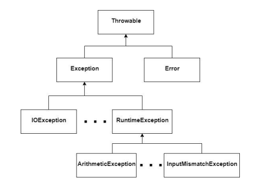

# Exceções II

- Em Java quando uma exceção ocorre utilizamos um lançamento, `throw`, com base nisso Java desenvolveu uma classe chamada `Throwable`, para que os desenvolvedores possam criar suas próprias exceções.

- Uma melhor explicação está nessa [pasta](../May_7/).
