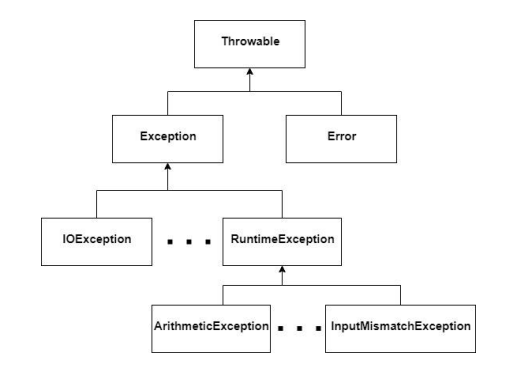

# Exceções

- Exceções são eventos que interropem a execução normal dos programas, como, por exemplo, um erro em alguma operação. Exceções podem ser capturadas e tratadas através dos comandos `try`..`catch`.
- Um programador pode capturar as exceções predefinidas que java oferece, ou pode criar suas próprias exceções.
- Como exemplo de uma exceção predefinida por java, considere um programa que lê um valor inteiro usando a classe *Scanner*:

```Java
package br.uepg.deinfo.msouza;

import java.util.Scanner;

public class Exemplo {
	public static void main(String[] args){
		Scanner le = new Scanner(System.in);
		int a;

		System.out.println("Digite um número: ");
		a = le.nextInt();
		System.out.println("Li o valor "+a);
	}
}
```

- Se essa classe é executada e o usuário digitar um valor real em vez de um inteiro, a aplicação será terminada e retornará a seguinte mensagem:

```
Digite um número:
2.5
Exception in thread "main" java.util.InputMismatchException
	at java.util.Scanner.throwFor(Scanner.java:864)
	at java.util.Scanner.next(Scanner.java:1485)
	at java.util.Scanner.nextInt(Scanner.java:2117)
	at java.util.Scanner.nextInt(Scanner.java:2076)
	at br.uepg.deinfo.msouza.Exemplo.main(Exemplo.java:13)
```

- Essa mensagem é retornada pela máquina virtual de java, e mostra que ocorreu uma exceção na linha 13 do método `main` da classe `Exemplo`. A exceção ocorrida se chama `InputMismatchException`, e está localizada no pacote `java.util` (o mesmo pacote da classe *Scanner*). Essa exceção mostra que foi digitado um valor de tipo diferente do esperado.
- Para evitar que a aplicação pare, o programador pode capturar a exceção, usando o comando `try`..`catch`, e fazer algum tipo de tratamento. O código abaixo faz isso, e imprime a mensagem *"Digite um inteiro: "* caso a exceção ocorra.

```Java
package br.uepg.deinfo.msouza;

import java.util.Scanner;
import java.util.InputMismatchException;

public class Exemplo {
	public static void main(String[] args){
		Scanner le = new Scanner(System.in);
		int a;
		
		do {
			try{
				System.out.println("Digite um número: ");
				a = le.nextInt();
				System.out.println("Li o valor "+a);
				return;
			}
			catch(InputMismatchException ex){
				System.out.println("DIGITE UM NÚMERO INTEIRO!");
				le.nextLine();
			}
		} while(true)
	}
}
```

- Todos os comandos que gerarem exceções devem ser incluído dentro do bloco `try`..`catch`, e cada tipo de exceção geralmente vai ter um `catch` específico para ele, mas é possível capturar dois ou mais tipos de exceções no mesmo `catch`.
- O comando `try`..`catch` pode, opcionalmente, incluir o comando `finally`, mas ele é usado em casos específicos.
- Existem diferentes tipos de exceções em java, e todas elas são representadas por classes. Para ser considerada uma exceção, uma classe deve ser descendente da classe `Throwable`, e a partir dela são geradas por herança as seguintes classes de exceções:



- As exceções `RuntimeException` e suas herdeiras e a exceção `Error` são definidas como **não verificadas**(unchecked), pois o seu tratamento não é obrigatório. A exceção `Exception` e suas herdeiras (com exceção de `RuntimeException`) são definidas como **verificadas**(checked), pois o seu tratamento é obrigatório.

- Quando um programa lança exceções verificadas, como java faz quando trabalhamos em algumas operações de E/S, o programador deve incluir um `try`..`catch` para tratar essa exceção, ou opcionalmente pode usar o comando **throws** para repassar essa responsabilidade para outro trecho do programa ou para a máquina virtual. Um exemplo do uso do comando **throws** será mostrado mais adiante.
- Uma exceção predefinida em java pode ser lançada por qualquer programa usando o comando **throw** (sem s), e é muito comum usar esse recurso para tratar qualquer tipo de erro que faça parte da lógica da aplicação.
- Por exemplo, considere uma classe `Carro` que possua dois atributos, modelo e potência. O atributo potência não pode receber um valor negativo. Sem o uso de exceções, geralmente o erro é informado por um comando que imprime na tela essa informação. Por exemplo:

```Java
public class Carro {
	private String modelo;
 	private int potencia;

	public void setPotencia(int potencia) {
		if (potencia<=0)
			System.out.println("Valor de potência incorreto");
 		else this.potencia = potencia;
 	}

 	public void setModelo(String modelo) {
 		this.modelo=modelo;
 	}

 	public String toString(){
 		return "Modelo: "+modelo+"Potência: "+potencia;
	}
}
```

- O mais correto é lançar uma exceção quando o erro ocorre, e para isso pode ser usada uma exceção predefinida de Java como `RunTimeException`.

```Java
public void setPotencia(int potencia){
	if(potencia<=0) throw new RunTimeException();
	else this.potencia = potencia;
}
```

- Nesse caso, se o usuário não tratar esse erro usando `try`..`catch`, a aplicação vai parar. Opcionalmente, pode ser passado como parâmetro para essa exceção uma mensagem que será impressa quando ela ocorrer.

```Java
public void setPotencia(int potencia){
	if(potencia<=0) throw new RunTimeException("Valor de potencia incorreto");
	else this.potencia = potencia;
}
```

- Uma abordagem mais recomendada é que o programador crie uma exceção própria para a aplicação. Para criar uma exceção, basta criar uma classe que estenda qualquer exceção de java.

- Nesse caso, é preferível estender uma exceção verificada, pois isso obriga os demais programadores a tratar as exceções geradas pela classe implementada. Normalmente isso é feito estendendo a exceção `Exception`. Por exemplo:

```Java
public class MinhaExcecao extends Exception{
	public MinhaExcecao(String msg){
		super(msg);
	}
}
```

- A exceção criada possui um construtor que recebe como parâmetro a mensagem do erro que gerou a exceção. O método `setPotencia` seria escrito da seguinte maneira:

```Java
public void setPotencia(int potencia) throws MinhaExcecao{
	if(potencia<=0) throw new MinhaExcecao("Valor em potencia incorreto");
	else this.potencia = potencia;
}
```

- Como a exceção gerada é obrigatória, ela deve ser tratada no momento em que é
gerada. Como o objetivo é que a classe que esteja executando o método setPotencia seja
responsável por tratar a exceção, usa-se o comando `throws` para repassar essa responsabilidade para ela. Se a classe que chamou o método `setPotencia` também usar o comando *throws*, a exceção é enviada para a máquina virtual ou para outra classe pertencente à aplicação. Se a exceção chegar até a máquina virtual, a aplicação termina.

- O método `main` de uma classe que manipule a classe `Carro` seria feito da seguinte maneira:

```Java
public class Principal {
	public static void main(String[] args){
		try{
			Carro c = new Carro();
			c.setPotencia(-20);
		}
		catch(MinhaExcecao ex){
			System.out.println(ex.getMessage());
		}
	}

}
```

- O método `getMessage()` retorna a mensagem de erro que foi incluída no lançamento da exceção.
