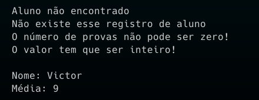

# Aula Prática – Programação Orientada a Objetos

- *Exemplos de exceções não verificadas em Java*
	- Crie uma classe chamada Aluno, que possui dois atributos privados, nome (String) e média (int). Por uma questão de limitações do software, o sistema apenas manipula números inteiros, então a média será um valor inteiro arredondado.
	- A classe Aluno não possui construtor, então devem ser criados dois métodos set para colocar valores nos atributos. Inclua também um método toString().
	- Em seguida, crie uma classe Principal na qual seja criado um vetor de objetos da classe
	- Aluno, de tamanho 2, e insira apenas um objeto na posição 0 do vetor.
	- Em seguida, escreva a seguinte sequência de comandos:
		- O usuário digita um índice do vetor (pode ser qualquer valor), que representa a posição do vetor que será manipulada;
		- Usuário digita uma string que inicializa o atributo nome do objeto inserido na posição digitada;
		- Usuário digita um número inteiro que representa a soma das notas do aluno;
		- Usuário digita um número inteiro que representa a quantidade de provas;
		- Valor da média é armazenado no atributo correspondente do objeto inserido na posição digitada;
		- Após preencher ambos os atributos, imprima as informações relacionadas ao objeto inserido na posição digitada.
	- Você deve verificar todas as exceções possíveis que podem ocorrer nesse trecho de programa, considerando que o usuário possa digitar qualquer valor que quiser, e escreva mensagens de erro explicando para o usuário o que aconteceu. Para descobrir as exceções, execute o programa forçando os possíveis erros, e veja qual exceção foi gerada.
	- Execute o trecho acima dentro de um comando de repetição, e repita o processo até que o usuário digite valores corretos. Os valores devem ser digitados usando a classe `JOptionPane`.

- [Classe Aluno](./Aluno.java)
- [Classe Principal](./Principal.java)
